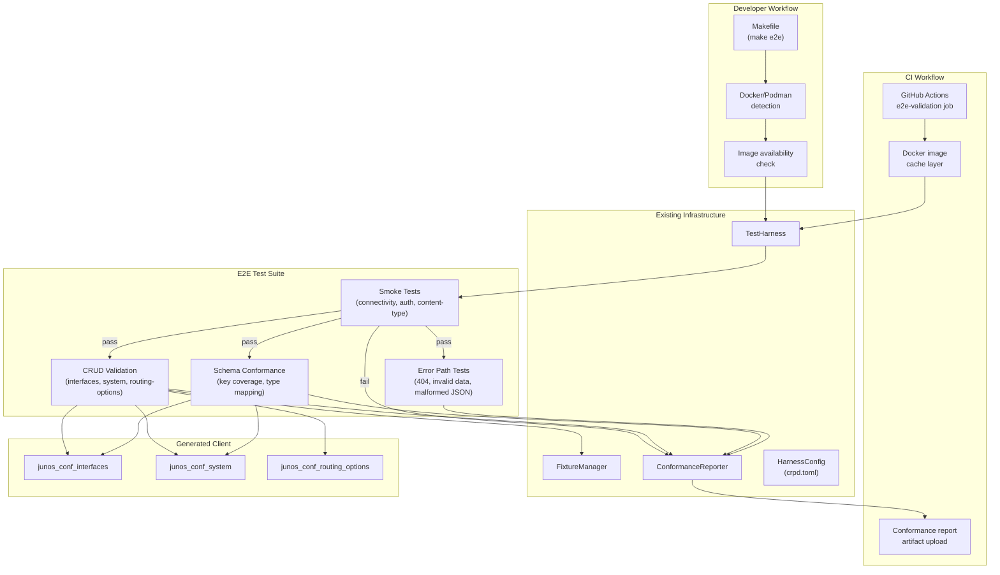
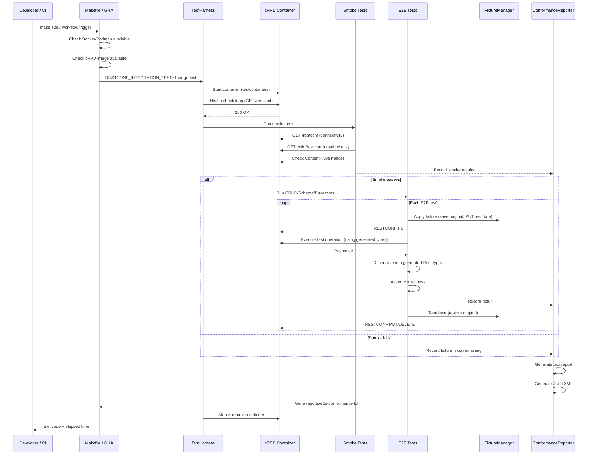

# Design Document: JunOS End-to-End Validation

## Overview

This design describes the end-to-end validation layer that exercises the rustconf-generated Juniper RESTCONF client against a live cRPD container. The existing `tests/integration/` infrastructure provides all the building blocks — `TestHarness` for container lifecycle, `FixtureManager` for state management, `ConformanceReporter` for structured output, and generated Juniper YANG client code. What's missing is the orchestration layer that ties these together into a reproducible developer workflow and CI pipeline.

This design adds three things:

1. **A Makefile-based runner** (`tests/integration/Makefile`) that provides a single `make e2e` command for local development
2. **A GitHub Actions workflow job** (`e2e-validation`) that runs the suite on PRs with cRPD image caching
3. **A new test file** (`tests/integration/tests/e2e_junos_tests.rs`) containing the Junos-specific E2E validation tests organized into smoke, CRUD, schema conformance, and error path categories

### Key Design Decisions

1. **Makefile over shell script**: A Makefile provides named targets (`e2e`, `e2e-smoke`, `e2e-clean`), dependency ordering, and is idiomatic for Rust projects that already use `cargo`. It also self-documents available commands via `make help`.

2. **Single test file with module organization**: Rather than spreading E2E tests across many files, a single `e2e_junos_tests.rs` file with internal modules (`smoke`, `crud`, `schema`, `errors`) keeps the E2E suite cohesive and distinct from the existing `client_tests.rs`/`error_tests.rs` which test generic RESTCONF behavior.

3. **Leverage existing FixtureManager for isolation**: Each test uses `FixtureManager::apply` / `teardown` for state management. Tests use unique resource name prefixes (e.g., `e2e-{test_name}-{uuid_prefix}`) to avoid collisions.

4. **Non-blocking CI job**: The E2E job is `continue-on-error: true` until the suite stabilizes. Conformance reports are always uploaded as artifacts regardless of pass/fail.

5. **Generated types used directly**: Tests import from `rustconf_integration_tests::generated::junos_conf_*` and exercise the actual generated `serde` serialization/deserialization rather than using raw `serde_json::Value` everywhere.

## Architecture



### Test Execution Flow



## Components and Interfaces

### Makefile (`tests/integration/Makefile`)

The Makefile provides the local developer workflow with these targets:

```makefile
# Primary targets
e2e          # Full E2E run: check prerequisites, start cRPD, run tests, stop, report
e2e-smoke    # Run only smoke tests (fast feedback)
e2e-clean    # Remove any orphaned containers and report files

# Prerequisite checks
check-runtime    # Verify Docker or Podman is available
check-image      # Verify cRPD image is loaded locally
load-image       # Load cRPD image from tarball (if CRPD_TARBALL is set)

# Configuration
CRPD_IMAGE     ?= crpd:23.4R1.10    # Read from config/crpd.toml
CRPD_TARBALL   ?=                     # Optional path to image tarball
CONTAINER_RT   ?= auto                # auto | docker | podman
TEST_FILTER    ?=                     # Optional test name filter
```

The Makefile:
- Auto-detects Docker vs Podman (tries `docker info`, falls back to `podman info`)
- Reads the image name from `config/crpd.toml` using a simple grep/sed extraction
- Sets `RUSTCONF_INTEGRATION_TEST=1` and `RUSTCONF_CONTAINER_IMAGE` before invoking cargo
- Uses `trap` equivalent (Make recipe error handling) to ensure cleanup on failure
- Reports total elapsed time at the end

### GitHub Actions Job

A new job `e2e-validation` in `.github/workflows/build.yml`:

```yaml
e2e-validation:
  runs-on: ubuntu-latest
  timeout-minutes: 15
  continue-on-error: true  # Non-blocking until stable
  needs: build             # Only run if build passes
  if: github.event_name == 'pull_request'

  steps:
    - checkout
    - setup Rust toolchain
    - restore Docker image cache
    - load cRPD image (from cache or secret)
    - run E2E suite with RUSTCONF_INTEGRATION_TEST=1
    - upload conformance report artifact (always)
    - upload JUnit XML for GitHub test summary
```

The job:
- Caches the cRPD Docker image layer using `actions/cache` keyed on the image tag from `config/crpd.toml`
- Skips gracefully if the image is unavailable (no secret configured) by checking exit code of `docker image inspect`
- Uploads `tests/integration/reports/e2e-conformance.txt` and `tests/integration/reports/e2e-junit.xml` as artifacts
- Uses the JUnit XML with a test reporter action for PR annotations

### E2E Test Organization (`tests/integration/tests/e2e_junos_tests.rs`)

```rust
//! End-to-end validation of generated Juniper client against live cRPD.

mod common;

// Test modules organized by category
mod smoke {
    //! Smoke tests: connectivity, auth, content-type
}

mod crud {
    //! CRUD validation across junos-conf-interfaces, junos-conf-system,
    //! junos-conf-routing-options
}

mod schema {
    //! Schema conformance: key coverage, Juniper-specific type deserialization,
    //! unknown key handling
}

mod errors {
    //! Error path validation: 404, invalid values, malformed JSON,
    //! RESTCONF error structure parsing
}
```

### Test Resource Naming

To ensure test isolation, all E2E tests use a naming convention for resources they create:

```rust
/// Generate a unique resource name for E2E tests.
/// Format: "e2e-{test_category}-{short_id}"
/// Example: "e2e-crud-a1b2c3"
fn e2e_resource_name(category: &str) -> String {
    let id = &uuid::Uuid::new_v4().to_string()[..6];
    format!("e2e-{category}-{id}")
}
```

This prevents collisions if tests run in parallel or if a previous run left orphaned state.

### Smoke Test Gate

The smoke tests act as a gate for the rest of the suite. If any smoke test fails, the remaining tests are skipped:

```rust
/// Shared state: set to true if smoke tests pass.
/// CRUD/schema/error tests check this before running.
static SMOKE_PASSED: AtomicBool = AtomicBool::new(false);

/// Macro to skip a test if smoke tests haven't passed.
macro_rules! skip_unless_smoke_passed {
    () => {
        if !SMOKE_PASSED.load(Ordering::SeqCst) {
            eprintln!("Skipping: smoke tests did not pass");
            return;
        }
    };
}
```

### Conformance Report Output

After all tests complete, the suite writes:
- `tests/integration/reports/e2e-conformance.txt` — human-readable text report
- `tests/integration/reports/e2e-junit.xml` — JUnit XML for CI integration

The report is generated using the existing `ConformanceReporter` with emulator name `"Juniper cRPD (E2E)"`.

## Data Models

### E2E Test Fixtures

New fixture files for Junos-specific E2E testing:

**`tests/integration/fixtures/junos-interfaces.json`**
```json
{
  "resource_path": "/data/junos-conf-interfaces:interfaces",
  "data": {
    "junos-conf-interfaces:interfaces": {
      "interface": [
        {
          "name": "ge-0/0/0",
          "unit": [
            {
              "name": "0",
              "family": {
                "inet": {
                  "address": [
                    {
                      "name": "192.0.2.1/24"
                    }
                  ]
                }
              }
            }
          ]
        }
      ]
    }
  }
}
```

**`tests/integration/fixtures/junos-system.json`**
```json
{
  "resource_path": "/data/junos-conf-system:system",
  "data": {
    "junos-conf-system:system": {
      "host-name": "e2e-test-device",
      "domain-name": "test.example.com",
      "name-server": [
        { "name": "8.8.8.8" }
      ]
    }
  }
}
```

**`tests/integration/fixtures/junos-routing-options.json`**
```json
{
  "resource_path": "/data/junos-conf-routing-options:routing-options",
  "data": {
    "junos-conf-routing-options:routing-options": {
      "static": {
        "route": [
          {
            "name": "0.0.0.0/0",
            "next-hop": ["192.0.2.254"]
          }
        ]
      }
    }
  }
}
```

### Configuration Extension

The existing `config/crpd.toml` is sufficient. The Makefile reads the `image` field to determine which image to check for. No new configuration files are needed.

### Report File Layout

```
tests/integration/
  reports/
    e2e-conformance.txt    # Human-readable report
    e2e-junit.xml          # JUnit XML for CI
    .gitkeep               # Ensure directory exists in repo
```

The `reports/` directory is added to `.gitignore` (except `.gitkeep`).

## Correctness Properties

*A property is a characteristic or behavior that should hold true across all valid executions of a system — essentially, a formal statement about what the system should do. Properties serve as the bridge between human-readable specifications and machine-verifiable correctness guarantees.*

### Property 1: CRUD write-read round-trip

*For any* valid Juniper configuration value (interface name, hostname, static route) that conforms to the YANG schema constraints, writing it to cRPD via the generated client types (PUT) and reading it back (GET) should produce a deserialized value equivalent to the original.

**Validates: Requirements 4.1, 4.3, 4.5, 5.2**

### Property 2: Delete removes resource

*For any* configuration element that was successfully created on cRPD, deleting it via the generated client (DELETE) and then reading the same path (GET) should return either HTTP 404 or a response that does not contain the deleted element.

**Validates: Requirements 4.4**

### Property 3: Schema key coverage

*For any* JSON response returned by cRPD for a resource covered by the generated Juniper types, every JSON key in the response should either correspond to a known field in the generated Rust type or be logged as a conformance warning — no key should cause a deserialization failure.

**Validates: Requirements 5.1, 5.5**

### Property 4: Non-existent paths return structured 404

*For any* RESTCONF path that does not correspond to an existing resource on cRPD, the generated client should return a response with HTTP status 404 and should never panic.

**Validates: Requirements 7.1**

### Property 5: Invalid inputs produce structured errors with RESTCONF error fields

*For any* invalid input (malformed JSON, constraint-violating values, schema-violating structure) sent to cRPD, the generated client should return a structured error that includes the HTTP status code, and when cRPD returns an `ietf-restconf:errors` body, the client should parse the `error-type`, `error-tag`, and `error-message` fields.

**Validates: Requirements 7.2, 7.3, 7.4**

### Property 6: Unique test resource names never collide

*For any* two calls to the test resource name generator, the generated names should be distinct (no collisions), ensuring parallel test isolation.

**Validates: Requirements 8.3**

### Property 7: Per-operation timeout enforcement

*For any* RESTCONF operation that exceeds the configured timeout duration (30 seconds), the test harness should abort the operation and return a timeout error rather than blocking indefinitely.

**Validates: Requirements 9.2**

### Property 8: Conformance report completeness

*For any* set of `TestResult` values recorded during an E2E run, the generated conformance report should contain every result grouped by YANG module, include request/response details for failures, and include skip reasons for skipped tests.

**Validates: Requirements 10.1, 10.2, 10.3**

## Error Handling

### Runner Script Errors

| Error Condition | Handling Strategy |
|---|---|
| No Docker/Podman installed | Print error message with install instructions, exit 1 |
| cRPD image not available | Print instructions for obtaining image (registry pull or tarball load), exit 1 |
| Image tag mismatch | Print warning with expected vs actual tag, continue execution |
| Container fails to start | Propagate `HarnessError::StartupFailed`, all tests skipped |
| Tests fail | Container still cleaned up (trap/finally), exit with test failure code |

### E2E Test Errors

| Error Condition | Handling Strategy |
|---|---|
| Smoke test fails | Set `SMOKE_PASSED = false`, skip all CRUD/schema/error tests, record in report |
| Fixture apply fails | Skip dependent test, record as `TestStatus::Skip` with reason |
| Fixture teardown fails | Log warning, continue with next test (best-effort cleanup) |
| Generated type deserialization fails | Record as `TestStatus::Fail` with conformance warning about unknown keys |
| Per-test timeout | Abort operation, record as `TestStatus::Fail` with timeout details |
| cRPD returns unexpected status | Record result, never panic — all HTTP statuses handled gracefully |

### CI-Specific Error Handling

| Error Condition | Handling Strategy |
|---|---|
| cRPD image not in cache/secret | Skip entire job gracefully, report skip in job summary |
| Job exceeds 15-minute timeout | GitHub Actions kills the job, partial report may be uploaded |
| E2E suite fails | Job marked as failed but `continue-on-error: true` prevents merge block |
| Report generation fails | Job still completes, artifact upload step is best-effort |

## Testing Strategy

### Dual Testing Approach

- **Integration tests** (require cRPD): Validate actual RESTCONF interactions — smoke checks, CRUD operations, schema conformance, error paths. These are the core E2E tests.
- **Property-based tests** (no emulator needed): Validate universal properties of the test infrastructure itself — resource name uniqueness, timeout enforcement, report completeness, fixture JSON round-trips.

### Property-Based Testing Configuration

- **Library**: `proptest` (already in workspace dependencies)
- **Minimum iterations**: 100 per property test
- **Each property test** references its design document property via a comment tag
- **Tag format**: `// Feature: junos-e2e-validation, Property {number}: {property_text}`

### Test Tiers

**Tier 1 — Always runs (no emulator needed)**:
- Resource name uniqueness (Property 6)
- Timeout enforcement with mock (Property 7)
- Conformance report completeness (Property 8)

**Tier 2 — Requires cRPD (gated by `RUSTCONF_INTEGRATION_TEST=1`)**:
- CRUD write-read round-trip (Property 1)
- Delete removes resource (Property 2)
- Schema key coverage (Property 3)
- Non-existent paths return 404 (Property 4)
- Invalid inputs produce structured errors (Property 5)

### Test Organization by YANG Module

The CRUD and schema tests cover at least three Juniper YANG modules:

| Module | Test Coverage |
|---|---|
| `junos-conf-interfaces` | Create interface, read interface list, update unit config, delete interface |
| `junos-conf-system` | Read system config, update hostname, update domain-name |
| `junos-conf-routing-options` | Create static route, read routing table, delete route |

### CI Integration

The existing `.github/workflows/build.yml` is extended with the `e2e-validation` job:

- Triggered only on pull requests to `main`
- Depends on the `build` job passing first
- Uses `actions/cache` for the Docker image layer
- Uploads conformance reports as artifacts on every run
- Non-blocking (`continue-on-error: true`) until the suite is stable
- Total job timeout: 15 minutes

### Property Test to Requirement Mapping

| Property | Test Location | Tier |
|---|---|---|
| Property 1: CRUD round-trip | `e2e_junos_tests.rs::crud` | 2 |
| Property 2: Delete removes | `e2e_junos_tests.rs::crud` | 2 |
| Property 3: Schema key coverage | `e2e_junos_tests.rs::schema` | 2 |
| Property 4: 404 on non-existent | `e2e_junos_tests.rs::errors` | 2 |
| Property 5: Structured errors | `e2e_junos_tests.rs::errors` | 2 |
| Property 6: Name uniqueness | `e2e_infra_tests.rs` | 1 |
| Property 7: Timeout enforcement | `e2e_infra_tests.rs` | 1 |
| Property 8: Report completeness | `e2e_infra_tests.rs` | 1 |
