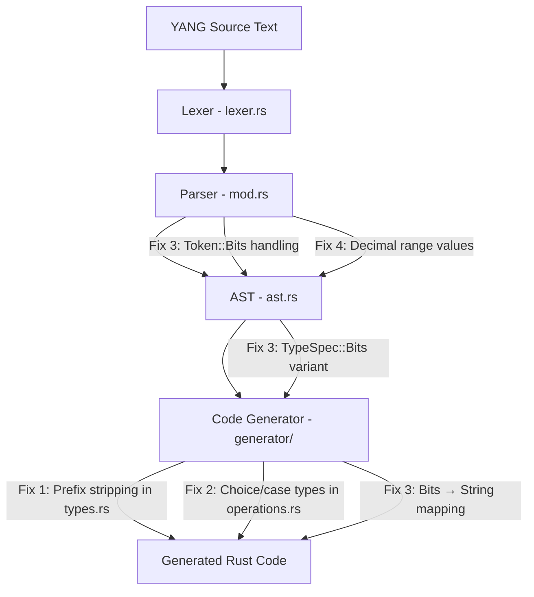

# Design Document: Junos Generator Compliance

## Overview

The previous `yang-parser-compliance` spec brought successful code generation from 4 to 31 out of 40 Juniper cRPD and IETF YANG models. Nine models still fail, grouped into four categories of parser and code generator gaps. This design addresses those four categories with surgical changes to bring all 40 models to successful generation.

The changes are ordered by impact (number of models unblocked):

| Category | Modules Affected | Files Changed |
|----------|-----------------|---------------|
| Prefixed type references in generator | 4 | `rustconf/src/generator/types.rs` |
| Decimal range values in parser | 3 | `rustconf/src/parser/mod.rs` |
| `bits` type support | 1 | `rustconf/src/parser/mod.rs`, `rustconf/src/parser/ast.rs`, `rustconf/src/generator/types.rs` |
| `choice`/`case` in RPC input/output | 1 | `rustconf/src/generator/operations.rs` |

### Key Design Decisions

1. **Prefix stripping in the generator, not the parser**: The parser already correctly stores `prefix:name` in `TypedefRef.name` (from the previous spec). The fix belongs in the generator's `generate_leaf_type` method, which currently passes the full `prefix:name` string to `to_type_name()`. We strip the prefix before calling `to_type_name()` rather than changing the AST representation.

2. **`bits` maps to `String` for initial support**: Like `enumeration`, `union`, and `leafref`, the `bits` type maps to `String` in generated Rust code. A proper bitflags struct is future work. This is sufficient to unblock `ietf-netconf-acm`.

3. **Decimal range values truncated to `i64`**: The existing `RangeConstraint` stores `i64` values. Decimal range values (used with `decimal64` types) are parsed as `f64` and truncated to `i64`. This is safe because `decimal64` range semantics are defined in terms of the scaled integer representation, and the semantic validator already checks bounds.

4. **RPC type generation delegates to `TypeGenerator`**: Rather than duplicating choice/case type generation logic in `OperationsGenerator`, we reuse `TypeGenerator::generate_choice` and `TypeGenerator::generate_case_struct` for choice/case nodes found in RPC input/output.

## Architecture

The changes span three layers of the rustconf pipeline:



**No lexer changes are required.** The lexer already produces `Token::Bits` and `Token::Bit`. All fixes are in the parser, AST, and code generator layers.

## Components and Interfaces

### 1. Generator Fix: Prefixed Type References (`rustconf/src/generator/types.rs`)

#### `generate_leaf_type` — Strip prefix from `TypedefRef.name`

**Current state**: The `TypedefRef` match arm passes the full `name` (which may be `prefix:name`) to `to_type_name()`. For `inet:ipv4-address`, this produces `Inet:ipv4Address` which fails `syn::parse_str`.

**Change**: Before calling `to_type_name()`, check if the name contains a colon and extract only the local name portion.

```rust
TypeSpec::TypedefRef { name } => {
    // Strip module prefix if present (e.g., "inet:ipv4-address" → "ipv4-address")
    let local_name = match name.rsplit_once(':') {
        Some((_, local)) => local,
        None => name.as_str(),
    };
    &crate::generator::naming::to_type_name(local_name)
}
```

This same prefix-stripping logic must also be applied in `generate_typedef` where `TypedefRef` names flow through to `syn::parse_str`, and in `data_node_to_struct_field` where leaf types are generated.

**Scope**: Only the `TypeSpec::TypedefRef` match arm in `generate_leaf_type` needs modification. The `to_type_name` function itself remains unchanged.

### 2. Parser Fix: `bits` Type Support (`rustconf/src/parser/mod.rs`, `rustconf/src/parser/ast.rs`)

#### New `TypeSpec::Bits` variant in AST

```rust
pub enum TypeSpec {
    // ... existing variants ...
    /// Bits type (RFC 7950 §9.7).
    /// Represents a set of named bit positions.
    Bits {
        bits: Vec<BitDef>,
    },
}

/// A single bit definition within a bits type.
#[derive(Debug, Clone, PartialEq)]
pub struct BitDef {
    pub name: String,
    pub position: Option<u32>,
    pub description: Option<String>,
}
```

#### `parse_type_spec` — Add `Token::Bits` match arm

**Current state**: No match arm for `Token::Bits`, causing `"Expected type name, found Bits"`.

**Change**: Add a match arm that creates `TypeSpec::Bits { bits: Vec::new() }`.

```rust
Token::Bits => {
    self.advance();
    TypeSpec::Bits { bits: Vec::new() }
}
```

#### `parse_type_body` — Handle `Token::Bit` inside a `Bits` type

**Change**: Add handling for `Token::Bit` statements inside a bits type body, similar to how `Token::Enum` is handled inside an enumeration type body.

```rust
Token::Bit => {
    if let TypeSpec::Bits { ref mut bits } = type_spec {
        let bit_def = self.parse_bit_def()?;
        bits.push(bit_def);
    } else {
        self.skip_unknown_statement()?;
    }
}
```

#### New `parse_bit_def` method

```rust
fn parse_bit_def(&mut self) -> Result<BitDef, ParseError> {
    self.expect(Token::Bit)?;
    let name = self.parse_identifier_or_keyword()?;

    let mut bit_def = BitDef {
        name,
        position: None,
        description: None,
    };

    // Check for bit body
    if self.peek() == &Token::LeftBrace {
        self.advance();
        while self.peek() != &Token::RightBrace && self.peek() != &Token::Eof {
            match self.peek() {
                Token::Position => {
                    self.advance();
                    // Parse position value
                    let pos_str = self.parse_identifier_or_keyword()?;
                    bit_def.position = Some(pos_str.parse::<u32>().map_err(|_| {
                        self.error(format!("Invalid bit position: {}", pos_str))
                    })?);
                    self.expect(Token::Semicolon)?;
                }
                Token::Description => { /* handle description */ }
                _ => { self.skip_unknown_statement()?; }
            }
        }
        self.expect(Token::RightBrace)?;
    } else {
        self.expect(Token::Semicolon)?;
    }

    Ok(bit_def)
}
```

#### Generator: `TypeSpec::Bits` → `String`

In `generate_leaf_type` in `types.rs`:

```rust
TypeSpec::Bits { .. } => "String",
```

Also update `needs_validation` and `get_validated_type_name` to handle the new variant (no validation needed for initial String mapping).

### 3. Generator Fix: `choice`/`case` in RPC Input/Output (`rustconf/src/generator/operations.rs`)

#### `generate_rpc_types` — Generate type definitions for choice/case nodes

**Current state**: `generate_rpc_types` iterates over input/output data nodes and calls `type_gen.generate_field()` to produce struct fields. When a `DataNode::Choice` is encountered, `generate_field` emits a field referencing a type name (e.g., `Source`), but the corresponding enum and case struct definitions are never generated. The `check_generated_module` function in `build.rs` catches this as an undefined type reference.

**Change**: After generating the struct fields for input/output, iterate over the data nodes again and generate type definitions for any `Choice` or `Case` nodes, using the existing `TypeGenerator::generate_choice` and `TypeGenerator::generate_case_struct` methods.

```rust
fn generate_rpc_types(&self, rpc: &Rpc, module: &YangModule) -> Result<String, GeneratorError> {
    let mut output = String::new();
    let rpc_type_name = crate::generator::naming::to_type_name(&rpc.name);
    let type_gen = crate::generator::types::TypeGenerator::new(self.config);

    // Generate input type if RPC has input
    if let Some(ref input_nodes) = rpc.input {
        if !input_nodes.is_empty() {
            // ... existing struct generation ...

            // Generate type definitions for choice/case nodes in input
            for node in input_nodes {
                output.push_str(&self.generate_nested_types(node, module, &type_gen)?);
            }
        }
    }

    // Generate output type if RPC has output
    if let Some(ref output_nodes) = rpc.output {
        if !output_nodes.is_empty() {
            // ... existing struct generation ...

            // Generate type definitions for choice/case nodes in output
            for node in output_nodes {
                output.push_str(&self.generate_nested_types(node, module, &type_gen)?);
            }
        }
    }

    Ok(output)
}

/// Generate nested type definitions (choice enums, case structs, container structs)
/// for data nodes that appear in RPC input/output.
fn generate_nested_types(
    &self,
    node: &DataNode,
    module: &YangModule,
    type_gen: &TypeGenerator,
) -> Result<String, GeneratorError> {
    match node {
        DataNode::Choice(choice) => type_gen.generate_choice(choice, module),
        DataNode::Container(container) => type_gen.generate_container(container, module),
        DataNode::List(list) => type_gen.generate_list(list, module),
        _ => Ok(String::new()),
    }
}
```

### 4. Parser Fix: Decimal Range Values (`rustconf/src/parser/mod.rs`)

#### `parse_range_value` — Accept decimal values

**Current state**: `parse_range_value` handles `"min"`, `"max"`, and integer strings. Decimal values like `"0.001"` fail with `"Invalid range value"`.

**Change**: Add an `f64` parsing fallback after the `i64` and `u64` attempts. The `f64` value is truncated to `i64` since the existing `RangeConstraint` structure uses `i64`.

```rust
fn parse_range_value(&self, s: &str) -> Result<i64, ParseError> {
    let trimmed = s.trim();
    match trimmed {
        "min" => Ok(i64::MIN),
        "max" => Ok(i64::MAX),
        _ => trimmed
            .parse::<i64>()
            .or_else(|_| {
                // Values exceeding i64::MAX (e.g. u64::MAX for uint64 ranges)
                trimmed.parse::<u64>().map(|v| {
                    if v > i64::MAX as u64 { i64::MAX } else { v as i64 }
                })
            })
            .or_else(|_| {
                // Decimal values (e.g. 0.001 for decimal64 ranges)
                trimmed.parse::<f64>().map(|v| v as i64)
            })
            .map_err(|_| self.error(format!("Invalid range value: {}", trimmed))),
    }
}
```

**Rationale**: YANG `decimal64` types define ranges in terms of the decimal representation, but the underlying storage is a scaled integer. Truncating to `i64` is acceptable because:
- The range constraint is used for validation, not computation
- The semantic validator already checks that range values fit the actual YANG type
- For `decimal64` with `fraction-digits 3`, the value `0.001` represents the smallest positive value, which truncates to `0` — this is conservative (allows more values through) rather than restrictive

## Data Models

### AST Type Changes

```rust
// In ast.rs — additions only

/// A single bit definition within a bits type.
#[derive(Debug, Clone, PartialEq)]
pub struct BitDef {
    pub name: String,
    pub position: Option<u32>,
    pub description: Option<String>,
}

pub enum TypeSpec {
    // ... all existing variants unchanged ...

    /// Bits type (RFC 7950 §9.7).
    /// Represents a set of named bit positions.
    Bits {
        bits: Vec<BitDef>,
    },
}
```

### No changes to:
- `TypedefRef` — prefix stripping happens in the generator, not the AST
- `RangeConstraint` / `Range` — decimal values are converted to `i64` during parsing
- `Choice` / `Case` — the AST already represents these correctly; the fix is in code generation
- `Rpc` — input/output already store `Vec<DataNode>` which can contain `Choice` nodes

## Correctness Properties

*A property is a characteristic or behavior that should hold true across all valid executions of a system — essentially, a formal statement about what the system should do. Properties serve as the bridge between human-readable specifications and machine-verifiable correctness guarantees.*

### Property 1: Prefix stripping idempotence

*For any* pair of valid YANG identifiers `(prefix, local_name)`, when the code generator processes a `TypeSpec::TypedefRef` with name `"prefix:local_name"`, the generated Rust type name SHALL be identical to the type name generated from a `TypeSpec::TypedefRef` with name `"local_name"` alone, and the result SHALL be a valid Rust type string (passes `syn::parse_str`).

**Validates: Requirements 1.1, 1.2, 1.4, 1.5**

### Property 2: Bits type bit definition preservation

*For any* set of valid bit definitions (name and optional position pairs), constructing a `type bits { bit <name> { position <pos>; } ... }` block and parsing it SHALL produce a `TypeSpec::Bits` AST node whose `bits` vector contains exactly the same names and positions in order.

**Validates: Requirements 2.1, 2.2**

### Property 3: RPC choice/case type completeness

*For any* RPC definition containing `choice`/`case` data nodes in its input or output, the set of type names referenced in the generated struct fields SHALL be a subset of the type names defined in the generated code output (no undefined type references).

**Validates: Requirements 3.1, 3.2, 3.3, 3.5**

### Property 4: Decimal range parsing well-formedness

*For any* range constraint string containing decimal values (optionally mixed with `min`, `max` keywords and `|` separators), where each range part has `lower <= upper`, parsing the constraint SHALL produce a `RangeConstraint` whose `Range` entries all satisfy `min <= max`.

**Validates: Requirements 4.1, 4.3, 4.4, 4.5**

## Error Handling

### Parse Errors

| Condition | Error Type | Message |
|-----------|-----------|---------|
| Invalid bit position value | `ParseError::SyntaxError` | `"Invalid bit position: <value>"` |
| Decimal range value that fails `f64` parse | `ParseError::SyntaxError` | `"Invalid range value: <value>"` |
| `type bits` with invalid bit body | `ParseError::SyntaxError` | Standard unexpected token error |

### Graceful Degradation

- **Prefixed type references**: The generator strips the prefix and generates code using only the local name. If the local name doesn't correspond to a defined typedef, the generated code will have a compilation error referencing an undefined type — this is the expected behavior for unresolved cross-module references (same as before, but now the type name is at least valid Rust syntax).
- **Decimal range truncation**: Truncating `0.001` to `0` is conservative — it widens the allowed range rather than narrowing it. This means validation may accept values that a strict `decimal64` range would reject, but it will never reject valid values.
- **Empty bits type**: Accepted without error, producing `TypeSpec::Bits { bits: vec![] }`. This handles the case where bits are defined in a base typedef.

## Testing Strategy

### Property-Based Tests (proptest)

Property-based tests use the `proptest` crate (already a workspace dev-dependency) with a minimum of 100 iterations per property. Each test is tagged with a comment referencing the design property.

| Property | Test Description | Generator Strategy |
|----------|-----------------|-------------------|
| Property 1 | Prefix stripping idempotence | Generate pairs of valid YANG identifiers (letter followed by alphanumeric/hyphens). Construct `TypeSpec::TypedefRef { name: "prefix:local" }`, call `generate_leaf_type`, compare with result from `TypeSpec::TypedefRef { name: "local" }`. Verify both pass `syn::parse_str`. |
| Property 2 | Bits type bit definition preservation | Generate vectors of `(name: String, position: Option<u32>)` pairs. Construct YANG `type bits { ... }` text, parse, verify `TypeSpec::Bits` contains matching bit definitions. |
| Property 3 | RPC choice/case type completeness | Generate RPC definitions with random choice/case structures. Generate code, extract type references from struct fields, extract type definitions, verify references ⊆ definitions. |
| Property 4 | Decimal range well-formedness | Generate range strings with decimal values (f64 in reasonable range), `min`, `max` keywords, and `|` separators. Parse, verify all `Range` entries have `min <= max`. |

### Unit Tests (example-based)

| Test | Description | Validates |
|------|-------------|-----------|
| `test_prefixed_typedef_generates_valid_type` | `TypedefRef { name: "inet:ipv4-address" }` generates `Ipv4Address` | Req 1.1 |
| `test_bits_type_parses` | Parse `type bits { bit read; bit write { position 1; } }` | Req 2.1, 2.2 |
| `test_bits_empty_body` | Parse `type bits;` and `type bits {}` succeed | Req 2.5 |
| `test_bits_generates_string` | `TypeSpec::Bits` generates `String` type | Req 2.3 |
| `test_rpc_choice_generates_types` | RPC with choice in input generates enum + case structs | Req 3.1, 3.2 |
| `test_decimal_range_parses` | Parse `"0.001..max"` succeeds | Req 4.1 |
| `test_decimal_range_multi_part` | Parse `"0.001..1.0 | 2.0..max"` produces 2 ranges | Req 4.4 |

### Integration Tests

| Test | Description | Validates |
|------|-------------|-----------|
| `test_all_40_models_generate` | Run integration harness against 40 vendor models, assert all 40 succeed | Req 5.1 |
| `test_zero_validation_failures` | Verify `check_generated_module` reports no failures for any module | Req 5.3 |
| Update `MIN_PASSING_MODELS` | Change threshold from 34 to 40 | Req 5.4 |

### Test Configuration

- **Property test iterations**: 100 minimum per property (proptest default `PROPTEST_CASES=100`)
- **Tag format**: `// Feature: junos-generator-compliance, Property N: <property_text>`
- **Test location**: `rustconf/src/parser/tests/` for parser properties, `rustconf/src/generator/tests/` for codegen tests
- **Integration tests**: `tests/integration/tests/` using existing harness
