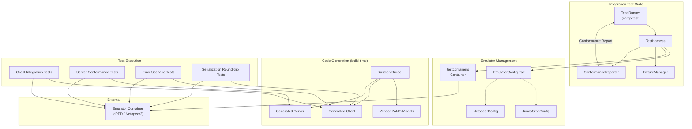
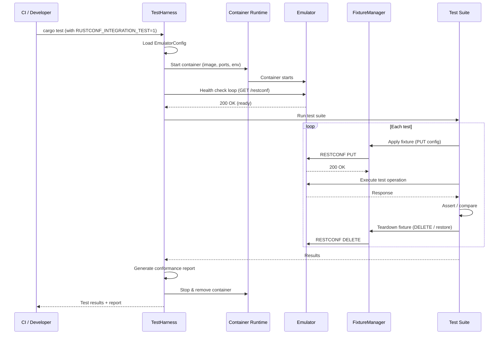

# Design Document: JunOS Integration Testing

## Overview

This design describes an integration testing harness for rustconf that validates generated RESTCONF client and server code against live network OS emulators. The existing test suite (unit tests, property tests, client-server round-trip tests in `rustconf/src/generator/tests/`) operates entirely in-process with mock transports and generated stubs. While these catch code generation bugs, they cannot detect protocol-level mismatches, serialization quirks, or YANG interpretation differences that only surface when talking to a real RESTCONF implementation.

The integration test harness introduces a new workspace crate (`tests/integration/`) that:

1. Manages containerized emulator lifecycle (start, health-check, teardown)
2. Generates client/server code from vendor YANG models at test time
3. Executes RESTCONF operations over HTTP against the live emulator
4. Compares generated server responses against emulator responses for conformance
5. Produces structured conformance reports

The harness is designed for two modes:
- **Full integration mode**: Requires a container runtime and emulator image (gated by `RUSTCONF_INTEGRATION_TEST=1`). Runs the complete test suite against a real emulator (e.g., Juniper cRPD).
- **Lightweight conformance mode**: Always runs in CI. Validates protocol-level correctness (URL construction, JSON serialization format, error structures) using Netopeer2 or a mock RESTCONF server that enforces RFC 8040 without vendor-specific behavior.

### Key Design Decisions

1. **Separate crate, not inline tests**: Integration tests live in their own workspace crate rather than as `#[cfg(test)]` modules inside `rustconf`. This keeps the main crate's compile times unaffected and allows the integration crate to depend on both `rustconf` (for code generation) and `rustconf-runtime` (for executing generated code).

2. **Container orchestration via `testcontainers-rs`**: Rather than shelling out to `docker` CLI, we use the `testcontainers` crate for deterministic container lifecycle. This gives us health-check polling, automatic cleanup on panic, and cross-platform support.

3. **Vendor YANG models checked into the repo**: Models are stored in `tests/integration/yang/{vendor}/` and sourced from [YangModels/yang](https://github.com/YangModels/yang). This avoids network fetches during tests.

4. **Emulator configuration as trait objects**: An `EmulatorConfig` trait abstracts vendor-specific details (image name, ports, credentials, YANG paths). Concrete implementations exist for each supported emulator. This supports Requirement 11 (Multi-Emulator Support).

5. **Fixture-based test state**: Test fixtures are defined as JSON files conforming to YANG-modeled data. A `TestFixture` struct handles apply/teardown via RESTCONF PUT/DELETE operations against the emulator.

## Architecture



### Control Flow



## Components and Interfaces

### EmulatorConfig Trait

Abstracts vendor-specific emulator details. Each supported emulator implements this trait.

```rust
/// Configuration for a RESTCONF emulator.
pub trait EmulatorConfig: Send + Sync {
    /// Container image name (e.g., "crpd:latest").
    fn image_name(&self) -> &str;

    /// RESTCONF port inside the container.
    fn restconf_port(&self) -> u16;

    /// Default credentials (username, password).
    fn credentials(&self) -> (&str, &str);

    /// Path prefix for RESTCONF endpoints (e.g., "/restconf").
    fn restconf_base_path(&self) -> &str;

    /// Whether the emulator uses TLS.
    fn uses_tls(&self) -> bool;

    /// Directory containing vendor YANG models for this emulator.
    fn yang_model_dir(&self) -> &Path;

    /// Health check URL path (e.g., "/.well-known/host-meta" or "/restconf").
    fn health_check_path(&self) -> &str;

    /// Vendor identifier for conformance reports.
    fn vendor_name(&self) -> &str;

    /// Environment variables to set on the container.
    fn container_env(&self) -> Vec<(String, String)>;
}
```

### TestHarness

Orchestrates emulator lifecycle and provides test utilities.

```rust
pub struct TestHarness {
    config: Box<dyn EmulatorConfig>,
    container: Option<ContainerAsync<GenericImage>>,
    client: Option<RestconfClient<ReqwestTransport>>,
    base_url: String,
    health_timeout: Duration,
    test_timeout: Duration,
}

impl TestHarness {
    /// Create a new harness from config. Does not start the emulator yet.
    pub fn new(config: impl EmulatorConfig + 'static) -> Self;

    /// Start the emulator container and wait for health check.
    pub async fn start(&mut self) -> Result<(), HarnessError>;

    /// Get a configured RestconfClient pointing at the emulator.
    pub fn client(&self) -> &RestconfClient<ReqwestTransport>;

    /// Get the emulator's RESTCONF base URL.
    pub fn base_url(&self) -> &str;

    /// Stop and remove the emulator container.
    pub async fn stop(&mut self) -> Result<(), HarnessError>;

    /// Check if the emulator is currently running.
    pub fn is_running(&self) -> bool;
}
```

### FixtureManager

Manages test fixture lifecycle (apply, teardown, shared fixtures).

```rust
pub struct FixtureManager {
    client: RestconfClient<ReqwestTransport>,
    applied_fixtures: Vec<AppliedFixture>,
}

pub struct AppliedFixture {
    /// RESTCONF path where the fixture was applied.
    resource_path: String,
    /// Original data (if any) for rollback.
    original_data: Option<serde_json::Value>,
}

pub struct FixtureDefinition {
    /// RESTCONF resource path (e.g., "/data/ietf-interfaces:interfaces").
    pub resource_path: String,
    /// JSON data to PUT.
    pub data: serde_json::Value,
}

impl FixtureManager {
    pub fn new(client: RestconfClient<ReqwestTransport>) -> Self;

    /// Apply a fixture: save current state, PUT new config.
    pub async fn apply(&mut self, fixture: &FixtureDefinition) -> Result<(), HarnessError>;

    /// Restore all applied fixtures to their original state.
    pub async fn teardown(&mut self) -> Result<(), HarnessError>;

    /// Load a fixture definition from a JSON file.
    pub fn load_fixture(path: &Path) -> Result<FixtureDefinition, HarnessError>;
}
```

### ConformanceReporter

Collects test results and produces structured reports.

```rust
pub struct ConformanceReporter {
    results: Vec<TestResult>,
    emulator_name: String,
}

pub struct TestResult {
    pub yang_module: String,
    pub operation: String,
    pub status: TestStatus,
    pub details: Option<TestDetails>,
}

pub enum TestStatus {
    Pass,
    Fail,
    Skip { reason: String },
}

pub struct TestDetails {
    pub expected: Option<String>,
    pub actual: Option<String>,
    pub request: Option<String>,
    pub response: Option<String>,
    pub conformance_warnings: Vec<String>,
}

impl ConformanceReporter {
    pub fn new(emulator_name: &str) -> Self;

    /// Record a test result.
    pub fn record(&mut self, result: TestResult);

    /// Generate a human-readable report grouped by YANG module.
    pub fn generate_text_report(&self) -> String;

    /// Generate a JUnit XML report for CI.
    pub fn generate_junit_xml(&self) -> String;

    /// Summary counts (pass, fail, skip).
    pub fn summary(&self) -> (usize, usize, usize);
}
```

### HarnessError

Unified error type for the test harness.

```rust
#[derive(Debug, thiserror::Error)]
pub enum HarnessError {
    #[error("Emulator startup failed: {0}")]
    StartupFailed(String),

    #[error("Health check timed out after {0:?}")]
    HealthCheckTimeout(Duration),

    #[error("Emulator crashed during test: {0}")]
    EmulatorCrashed(String),

    #[error("Fixture apply failed: {0}")]
    FixtureApplyFailed(String),

    #[error("Fixture teardown failed: {0}")]
    FixtureTeardownFailed(String),

    #[error("Code generation failed: {0}")]
    CodegenFailed(String),

    #[error("RESTCONF error: {0}")]
    RestconfError(#[from] RpcError),

    #[error("Container error: {0}")]
    ContainerError(String),

    #[error("Configuration error: {0}")]
    ConfigError(String),

    #[error("Test timeout after {0:?}")]
    TestTimeout(Duration),

    #[error("IO error: {0}")]
    Io(#[from] std::io::Error),
}
```

### HarnessConfig

Runtime configuration loaded from env vars and config files.

```rust
pub struct HarnessConfig {
    /// Which emulator to use (e.g., "crpd", "netopeer2").
    pub emulator_type: String,
    /// Override container image.
    pub container_image: Option<String>,
    /// Override RESTCONF port.
    pub restconf_port: Option<u16>,
    /// Override credentials.
    pub username: Option<String>,
    pub password: Option<String>,
    /// Health check timeout.
    pub health_timeout: Duration,
    /// Per-test timeout.
    pub test_timeout: Duration,
    /// Whether to skip TLS verification.
    pub skip_tls_verify: bool,
    /// RESTCONF base URL override.
    pub base_url: Option<String>,
}

impl HarnessConfig {
    /// Load config from environment variables.
    ///
    /// Env vars:
    /// - RUSTCONF_EMULATOR_TYPE
    /// - RUSTCONF_CONTAINER_IMAGE
    /// - RUSTCONF_RESTCONF_PORT
    /// - RUSTCONF_USERNAME / RUSTCONF_PASSWORD
    /// - RUSTCONF_HEALTH_TIMEOUT_SECS
    /// - RUSTCONF_TEST_TIMEOUT_SECS
    /// - RUSTCONF_SKIP_TLS_VERIFY
    /// - RUSTCONF_BASE_URL
    pub fn from_env() -> Self;

    /// Load config from a TOML file, with env var overrides.
    pub fn from_file(path: &Path) -> Result<Self, HarnessError>;
}
```

## Data Models

### Fixture JSON Format

Test fixtures are JSON files following RFC 7951 (JSON encoding of YANG data). Example:

```json
{
  "resource_path": "/data/ietf-interfaces:interfaces",
  "data": {
    "ietf-interfaces:interfaces": {
      "interface": [
        {
          "name": "ge-0/0/0",
          "type": "iana-if-type:ethernetCsmacd",
          "enabled": true,
          "ietf-ip:ipv4": {
            "address": [
              {
                "ip": "192.0.2.1",
                "prefix-length": 24
              }
            ]
          }
        }
      ]
    }
  }
}
```

### Emulator Config File Format (TOML)

```toml
[emulator]
type = "crpd"
image = "crpd:23.4R1.10"
restconf_port = 3000
username = "root"
password = "Juniper1"
base_path = "/restconf"
uses_tls = true
skip_tls_verify = true
health_check_path = "/restconf"
yang_model_dir = "yang/juniper"

[timeouts]
health_check_secs = 120
test_timeout_secs = 30
```

### Conformance Report Structure

The conformance report is a structured summary grouped by YANG module:

```
=== Conformance Report: Juniper cRPD 23.4R1 ===

Module: ietf-interfaces (8 tests)
  ✓ GET  /data/ietf-interfaces:interfaces
  ✓ GET  /data/ietf-interfaces:interfaces/interface=ge-0/0/0
  ✓ PUT  /data/ietf-interfaces:interfaces/interface=ge-0/0/0
  ✗ PATCH /data/ietf-interfaces:interfaces/interface=ge-0/0/0
      Expected: 200, Got: 405 (Method Not Allowed)
      Request:  PATCH /restconf/data/ietf-interfaces:interfaces/interface=ge-0%2F0%2F0
      Response: {"ietf-restconf:errors":{"error":[...]}}
  ⊘ DELETE /data/ietf-interfaces:interfaces/interface=ge-0/0/0
      Skipped: YANG delete-on-remove not supported by emulator

Module: junos-conf-interfaces (4 tests)
  ✓ GET  /data/junos-conf-interfaces:interfaces
  ...

Summary: 18 passed, 2 failed, 3 skipped
```

### Project Layout

```
tests/
  integration/
    Cargo.toml
    src/
      lib.rs              # Re-exports harness modules
      harness.rs          # TestHarness struct
      config.rs           # HarnessConfig, EmulatorConfig trait
      emulators/
        mod.rs
        crpd.rs           # JunosCrpdConfig
        netopeer2.rs       # NetopeerConfig
      fixture.rs          # FixtureManager, FixtureDefinition
      reporter.rs         # ConformanceReporter
      error.rs            # HarnessError
    tests/
      common/mod.rs       # Shared test helpers
      client_tests.rs     # Client integration tests (Req 3)
      server_tests.rs     # Server conformance tests (Req 4)
      error_tests.rs      # Error scenario tests (Req 10)
      roundtrip_tests.rs  # Serialization round-trip tests (Req 7)
    yang/
      juniper/            # Juniper YANG models from YangModels/yang
      ietf/               # IETF standard models (dependencies)
    fixtures/
      interfaces.json     # Example fixture files
      system.json
    config/
      crpd.toml           # Reference cRPD config
      netopeer2.toml      # Reference Netopeer2 config
```


## Correctness Properties

*A property is a characteristic or behavior that should hold true across all valid executions of a system — essentially, a formal statement about what the system should do. Properties serve as the bridge between human-readable specifications and machine-verifiable correctness guarantees.*

### Property 1: Configuration round-trip from environment

*For any* valid combination of environment variable values (emulator type, container image, port, username, password, timeouts, TLS skip flag, base URL), loading a `HarnessConfig` from those environment variables should produce a config whose fields exactly match the values that were set.

**Validates: Requirements 1.6**

### Property 2: Data write-read round-trip

*For any* valid YANG-typed configuration value and any RESTCONF resource path, writing that value to the emulator via the Generated_Client (PUT) and then reading it back (GET) should produce a value equivalent to the original.

**Validates: Requirements 3.3, 7.1, 7.4**

### Property 3: GET responses deserialize into generated types

*For any* RESTCONF resource that exists on the emulator and any YANG type with constraints (ranges, patterns, enumerations), performing a GET via the Generated_Client should successfully deserialize the response into the corresponding generated Rust type without error, and the deserialized value should satisfy the YANG constraints defined in the schema.

**Validates: Requirements 3.2, 7.2**

### Property 4: JSON serialization uses RFC 7951 field names

*For any* generated Rust type instance, serializing it to JSON should produce field names that match the YANG-defined names: kebab-case identifiers with module prefixes where required by RFC 7951. No field name in the serialized output should use Rust's snake_case convention.

**Validates: Requirements 7.3**

### Property 5: Invalid inputs produce correctly mapped errors

*For any* invalid input (malformed JSON, constraint-violating values, or schema-violating data), sending it to the emulator via the Generated_Client should return an `RpcError` whose variant and status code match the emulator's error response category (e.g., 400 for bad request, 409 for constraint violation).

**Validates: Requirements 3.4, 10.2, 10.3**

### Property 6: No panic on any HTTP status code

*For any* HTTP status code returned by the emulator (including unexpected codes like 500, 502, 418), the Generated_Client should never panic and should always return a structured `RpcError` value.

**Validates: Requirements 10.1, 10.4**

### Property 7: Server response conformance

*For any* RESTCONF request sent to both the Generated_Server and the Emulator with the same input, the Generated_Server's response should have the same JSON key structure, nesting depth, and `Content-Type` header as the Emulator's response.

**Validates: Requirements 4.1, 4.2**

### Property 8: Server error responses follow RESTCONF format

*For any* error condition triggered on the Generated_Server, the error response body should be valid JSON conforming to the `ietf-restconf:errors` structure defined in RFC 8040, containing at minimum an `error-type`, `error-tag`, and `error-message` field.

**Validates: Requirements 4.3**

### Property 9: Fixture apply-teardown restores original state

*For any* fixture definition and any initial emulator configuration state, applying the fixture and then tearing it down should restore the emulator to its original state. A GET on the fixture's resource path after teardown should return the same data as before the fixture was applied.

**Validates: Requirements 6.2**

### Property 10: Fixture JSON loading round-trip

*For any* valid `FixtureDefinition` value, serializing it to a JSON file and loading it back via `FixtureManager::load_fixture` should produce an equivalent `FixtureDefinition`.

**Validates: Requirements 6.4**

### Property 11: Conformance report completeness and structure

*For any* set of `TestResult` values recorded in the `ConformanceReporter`, the generated text report should: (a) contain every result, (b) group results by their `yang_module` field, (c) include expected/actual/request/response details for every result with status `Fail`, and (d) include the skip reason for every result with status `Skip`.

**Validates: Requirements 8.2, 8.3, 8.4**

### Property 12: Per-test timeout enforcement

*For any* test operation that exceeds the configured `test_timeout` duration, the harness should abort the operation and return a `HarnessError::TestTimeout` rather than blocking indefinitely.

**Validates: Requirements 9.4**

### Property 13: Emulator config selects correct YANG models

*For any* `EmulatorConfig` implementation, the `yang_model_dir()` path should point to a directory that exists and contains `.yang` files corresponding to that emulator's vendor.

**Validates: Requirements 11.2**

### Property 14: Multi-emulator report separation

*For any* set of test results from N different emulator types, the conformance report should contain exactly N sections, each identified by the emulator's `vendor_name`, with no results from one emulator appearing under another's section.

**Validates: Requirements 11.3**

## Error Handling

### Emulator Lifecycle Errors

| Error Condition | Handling Strategy |
|---|---|
| Container fails to start | `HarnessError::StartupFailed` — all tests skipped, report generated with skip reason |
| Health check times out | `HarnessError::HealthCheckTimeout` — all tests skipped, timeout duration included in error |
| Container crashes mid-test | `HarnessError::EmulatorCrashed` — remaining tests aborted, partial report generated |
| Container cleanup fails | Logged as warning, does not fail the test run (containers may be orphaned) |

### Code Generation Errors

| Error Condition | Handling Strategy |
|---|---|
| Unsupported YANG construct | `HarnessError::CodegenFailed` — tests for that YANG module skipped, logged with construct details |
| YANG file not found | `HarnessError::Io` — test suite fails fast with file path in error |
| Invalid YANG syntax | `HarnessError::CodegenFailed` — propagated from rustconf parser |

### Test Execution Errors

| Error Condition | Handling Strategy |
|---|---|
| Fixture apply fails | `HarnessError::FixtureApplyFailed` — dependent test skipped, recorded in report |
| Fixture teardown fails | `HarnessError::FixtureTeardownFailed` — logged as warning, next fixture applies fresh |
| Per-test timeout | `HarnessError::TestTimeout` — test marked as failed with timeout duration |
| Network error mid-test | Propagated as `RpcError::TransportError` — test marked as failed |
| Unexpected panic in test | Caught by Rust test framework — test marked as failed |

### RESTCONF Protocol Errors

| Error Condition | Handling Strategy |
|---|---|
| 4xx client error | Mapped to `RpcError::HttpError` with status code and RESTCONF error body |
| 5xx server error | Mapped to `RpcError::HttpError` — test may retry once for transient errors |
| Malformed JSON response | `RpcError::DeserializationError` — raw response body included in report |
| TLS handshake failure | `RpcError::TransportError` — config hint to check `skip_tls_verify` setting |

### Graceful Degradation

The harness follows a strict escalation model:
1. **Single test failure** → test recorded as failed, next test runs
2. **Fixture failure** → dependent tests skipped, other fixtures unaffected
3. **Emulator crash** → all remaining tests aborted, partial report generated
4. **No emulator available** → all integration tests skipped (exit code 0)

## Testing Strategy

### Dual Testing Approach

The integration testing feature requires both unit tests and property-based tests:

- **Unit tests**: Verify specific examples, edge cases, and error conditions (e.g., health check timeout, fixture apply failure, specific RESTCONF error responses)
- **Property tests**: Verify universal properties across generated inputs (e.g., config round-trip, fixture JSON round-trip, report completeness, JSON field naming)

Both are complementary. Unit tests catch concrete bugs in specific scenarios. Property tests verify that invariants hold across the entire input space.

### Property-Based Testing Configuration

- **Library**: `proptest` (already in workspace dependencies)
- **Minimum iterations**: 100 per property test
- **Each property test** must reference its design document property via a comment tag
- **Tag format**: `// Feature: junos-integration-testing, Property {number}: {property_text}`
- **Each correctness property** is implemented by a single property-based test

### Test Organization

Tests are split into two tiers:

**Tier 1 — Always runs (no emulator needed)**:
- `HarnessConfig` env var loading (Property 1)
- `FixtureDefinition` JSON round-trip (Property 10)
- `ConformanceReporter` report generation (Property 11)
- JSON field name validation (Property 4)
- HTTP status code handling / no-panic (Property 6)
- Multi-emulator report separation (Property 14)
- Timeout enforcement with mock (Property 12)

**Tier 2 — Requires emulator (gated by `RUSTCONF_INTEGRATION_TEST=1`)**:
- Data write-read round-trip (Property 2)
- GET deserialization (Property 3)
- Invalid input error mapping (Property 5)
- Server response conformance (Property 7)
- Server error format (Property 8)
- Fixture apply-teardown round-trip (Property 9)
- Emulator config YANG model validation (Property 13)

### CI Integration

The existing `.github/workflows/build.yml` will be extended with:

1. A new job `integration-tests` that runs only when `RUSTCONF_INTEGRATION_TEST` is set
2. The job pulls the emulator container image, starts the harness, and runs Tier 2 tests
3. Tier 1 tests run as part of the normal `cargo test` in the existing `build` job
4. Test results are output as standard cargo test output (compatible with CI reporters)
5. The integration job is optional — its failure does not block merge, but is reported

### Property Test to Requirement Mapping

| Property | Test File | Tier |
|---|---|---|
| Property 1: Config env round-trip | `tests/config_tests.rs` | 1 |
| Property 2: Data write-read round-trip | `tests/roundtrip_tests.rs` | 2 |
| Property 3: GET deserialization | `tests/client_tests.rs` | 2 |
| Property 4: RFC 7951 field names | `tests/serialization_tests.rs` | 1 |
| Property 5: Invalid input error mapping | `tests/error_tests.rs` | 2 |
| Property 6: No panic on any status | `tests/error_tests.rs` | 1 |
| Property 7: Server conformance | `tests/server_tests.rs` | 2 |
| Property 8: Server error format | `tests/server_tests.rs` | 2 |
| Property 9: Fixture apply-teardown | `tests/roundtrip_tests.rs` | 2 |
| Property 10: Fixture JSON round-trip | `tests/fixture_tests.rs` | 1 |
| Property 11: Report completeness | `tests/reporter_tests.rs` | 1 |
| Property 12: Timeout enforcement | `tests/harness_tests.rs` | 1 |
| Property 13: Config-to-YANG mapping | `tests/config_tests.rs` | 2 |
| Property 14: Multi-emulator report | `tests/reporter_tests.rs` | 1 |
