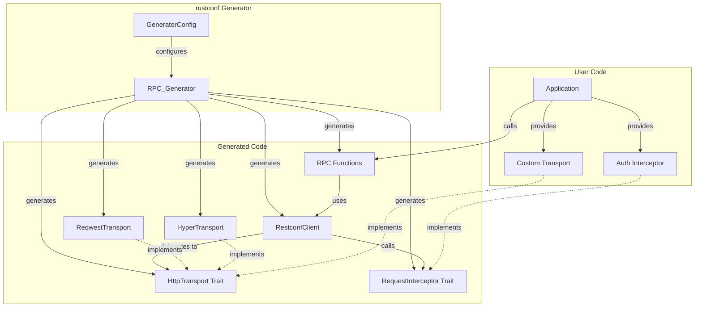
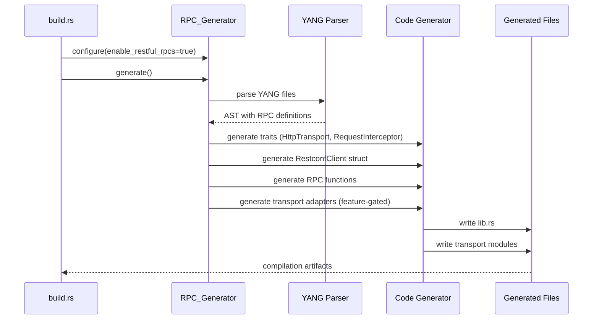
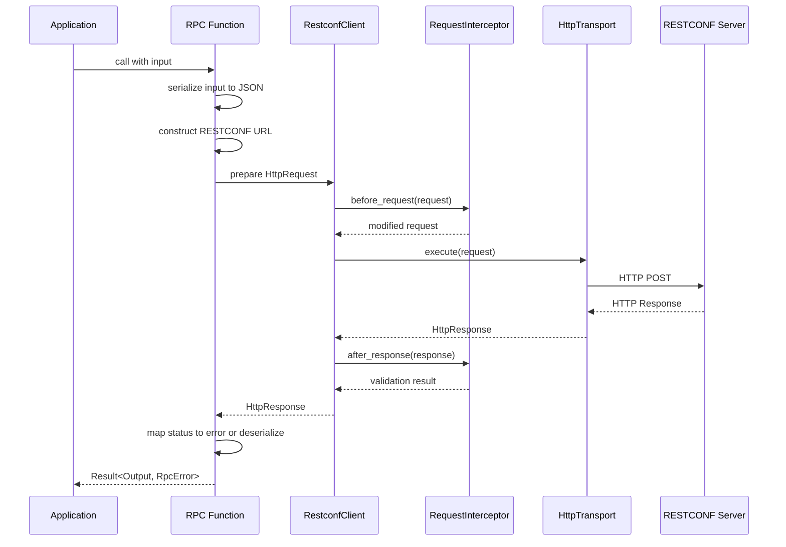

# Design Document: RESTful RPC Generation

## Overview

This design extends the rustconf code generator to produce functional RESTful HTTP client implementations from YANG/RESTCONF specifications. The architecture is additive and non-breaking, allowing users to opt-in via configuration flags.

The design centers around three key abstractions:

1. **HttpTransport trait**: A pluggable interface for HTTP execution, allowing users to choose between reqwest, hyper, or custom implementations
2. **RestconfClient struct**: A runtime-configurable client that manages base URLs, transport instances, and request interceptors
3. **Request Interceptor pattern**: A hook mechanism for authentication, logging, and request/response modification

The generated code maintains backward compatibility by defaulting to stub implementations when RESTful generation is disabled. When enabled, the generator produces async RPC functions that construct RESTCONF-compliant URLs, serialize inputs to JSON, execute HTTP requests through the transport layer, and deserialize responses to typed outputs.

## Architecture

### Component Diagram



### Code Generation Flow



### Runtime Request Flow



## Components and Interfaces

### HttpTransport Trait

The core abstraction for HTTP execution. All transport implementations must be async, Send, and Sync for use in concurrent contexts.

```rust
use async_trait::async_trait;

#[async_trait]
pub trait HttpTransport: Send + Sync {
    /// Execute an HTTP request and return the response
    async fn execute(&self, request: HttpRequest) -> Result<HttpResponse, RpcError>;
}

pub struct HttpRequest {
    pub method: HttpMethod,
    pub url: String,
    pub headers: Vec<(String, String)>,
    pub body: Option<Vec<u8>>,
}

pub struct HttpResponse {
    pub status_code: u16,
    pub headers: Vec<(String, String)>,
    pub body: Vec<u8>,
}

pub enum HttpMethod {
    GET,
    POST,
    PUT,
    DELETE,
    PATCH,
}
```

**Design Rationale**: The trait uses owned types rather than references to avoid lifetime complexity in async contexts. The simple structure makes it easy to implement custom transports without dealing with complex type constraints.

### RequestInterceptor Trait

Provides hooks for modifying requests before sending and validating responses after receiving. Supports authentication flows, logging, and custom header injection.

```rust
#[async_trait]
pub trait RequestInterceptor: Send + Sync {
    /// Called before sending the request. Can modify the request or abort with an error.
    async fn before_request(&self, request: &mut HttpRequest) -> Result<(), RpcError>;
    
    /// Called after receiving the response. Can validate or abort with an error.
    async fn after_response(&self, response: &HttpResponse) -> Result<(), RpcError>;
}
```

**Design Rationale**: The before_request hook receives a mutable reference to allow in-place modification (efficient for adding headers). The after_response hook receives an immutable reference since response modification would be confusing (the RPC function handles deserialization). Both return Result to allow early termination.

### RestconfClient Struct

The main client struct that coordinates transport, interceptors, and configuration.

```rust
pub struct RestconfClient<T: HttpTransport> {
    base_url: String,
    transport: T,
    interceptor: Option<Box<dyn RequestInterceptor>>,
}

impl<T: HttpTransport> RestconfClient<T> {
    /// Create a new client with the given base URL and transport
    pub fn new(base_url: impl Into<String>, transport: T) -> Self {
        Self {
            base_url: base_url.into(),
            transport,
            interceptor: None,
        }
    }
    
    /// Add a request interceptor for auth, logging, etc.
    pub fn with_interceptor(mut self, interceptor: impl RequestInterceptor + 'static) -> Self {
        self.interceptor = Some(Box::new(interceptor));
        self
    }
    
    /// Execute a request through the transport with interceptor hooks
    pub(crate) async fn execute_request(&self, mut request: HttpRequest) -> Result<HttpResponse, RpcError> {
        // Call before_request hook if interceptor is configured
        if let Some(ref interceptor) = self.interceptor {
            interceptor.before_request(&mut request).await?;
        }
        
        // Execute the request
        let response = self.transport.execute(request).await?;
        
        // Call after_response hook if interceptor is configured
        if let Some(ref interceptor) = self.interceptor {
            interceptor.after_response(&response).await?;
        }
        
        Ok(response)
    }
    
    /// Get the base URL for this client
    pub(crate) fn base_url(&self) -> &str {
        &self.base_url
    }
}
```

**Design Rationale**: The generic type parameter allows compile-time selection of transport without dynamic dispatch overhead. The single optional interceptor keeps the API simple while supporting the most common use case (authentication). The execute_request method is pub(crate) to keep it accessible to generated RPC functions while hiding it from external users.

### Generated RPC Functions

Each YANG RPC definition generates an async function that constructs URLs, serializes inputs, executes requests, and deserializes outputs.

```rust
/// Reset a network interface
/// 
/// # Arguments
/// * `client` - The RestconfClient to use for the request
/// * `input` - The input parameters for the RPC
/// 
/// # Returns
/// The RPC output or an error
/// 
/// # Example
/// ```
/// use my_bindings::*;
/// 
/// let transport = reqwest_adapter::ReqwestTransport::new();
/// let client = RestconfClient::new("https://router.example.com", transport);
/// 
/// let result = reset_interface(&client, ResetInterfaceInput {
///     interface_name: "eth0".to_string(),
/// }).await?;
/// ```
pub async fn reset_interface<T: HttpTransport>(
    client: &RestconfClient<T>,
    input: ResetInterfaceInput,
) -> Result<ResetInterfaceOutput, RpcError> {
    // Serialize input to JSON
    let body = serde_json::to_vec(&input)
        .map_err(|e| RpcError::SerializationError(format!("Failed to serialize input: {}", e)))?;
    
    // Construct RESTCONF URL with namespace
    let url = format!(
        "{}/restconf/operations/{}:{}",
        client.base_url(),
        "interface-mgmt",  // module name from YANG
        "reset-interface"   // operation name
    );
    
    // Build HTTP request
    let request = HttpRequest {
        method: HttpMethod::POST,
        url,
        headers: vec![
            ("Content-Type".to_string(), "application/yang-data+json".to_string()),
            ("Accept".to_string(), "application/yang-data+json".to_string()),
        ],
        body: Some(body),
    };
    
    // Execute request through client
    let response = client.execute_request(request).await?;
    
    // Map HTTP status to error or deserialize response
    match response.status_code {
        200..=299 => {
            // Success - deserialize response body
            serde_json::from_slice(&response.body)
                .map_err(|e| RpcError::DeserializationError(format!("Failed to deserialize response: {}", e)))
        }
        400 => Err(RpcError::InvalidInput(
            String::from_utf8_lossy(&response.body).to_string()
        )),
        401 | 403 => Err(RpcError::Unauthorized(
            String::from_utf8_lossy(&response.body).to_string()
        )),
        404 => Err(RpcError::NotFound(
            String::from_utf8_lossy(&response.body).to_string()
        )),
        500..=599 => Err(RpcError::ServerError(
            String::from_utf8_lossy(&response.body).to_string()
        )),
        _ => Err(RpcError::UnknownError(
            format!("Unexpected status code: {}", response.status_code)
        )),
    }
}
```

**Design Rationale**: Functions take a client reference rather than owning it, allowing reuse across multiple calls. The generic type parameter on the function (not the client) allows the compiler to monomorphize for each transport type. Error handling is explicit at each step (serialization, request execution, deserialization) to provide clear error messages.

### Transport Adapters

#### Reqwest Adapter

```rust
#[cfg(feature = "reqwest-client")]
pub mod reqwest_adapter {
    use super::*;
    use async_trait::async_trait;
    
    /// HTTP transport implementation using reqwest
    /// 
    /// # Example
    /// ```
    /// let transport = ReqwestTransport::new();
    /// let client = RestconfClient::new("https://device.example.com", transport);
    /// ```
    pub struct ReqwestTransport {
        client: reqwest::Client,
    }
    
    impl ReqwestTransport {
        pub fn new() -> Self {
            Self {
                client: reqwest::Client::new(),
            }
        }
        
        pub fn with_client(client: reqwest::Client) -> Self {
            Self { client }
        }
    }
    
    #[async_trait]
    impl HttpTransport for ReqwestTransport {
        async fn execute(&self, request: HttpRequest) -> Result<HttpResponse, RpcError> {
            // Convert HttpMethod to reqwest::Method
            let method = match request.method {
                HttpMethod::GET => reqwest::Method::GET,
                HttpMethod::POST => reqwest::Method::POST,
                HttpMethod::PUT => reqwest::Method::PUT,
                HttpMethod::DELETE => reqwest::Method::DELETE,
                HttpMethod::PATCH => reqwest::Method::PATCH,
            };
            
            // Build reqwest request
            let mut req_builder = self.client.request(method, &request.url);
            
            // Add headers
            for (key, value) in request.headers {
                req_builder = req_builder.header(key, value);
            }
            
            // Add body if present
            if let Some(body) = request.body {
                req_builder = req_builder.body(body);
            }
            
            // Execute request
            let response = req_builder.send().await
                .map_err(|e| RpcError::TransportError(format!("HTTP request failed: {}", e)))?;
            
            // Extract response data
            let status_code = response.status().as_u16();
            let headers = response.headers()
                .iter()
                .map(|(k, v)| (k.to_string(), v.to_str().unwrap_or("").to_string()))
                .collect();
            let body = response.bytes().await
                .map_err(|e| RpcError::TransportError(format!("Failed to read response body: {}", e)))?
                .to_vec();
            
            Ok(HttpResponse {
                status_code,
                headers,
                body,
            })
        }
    }
}
```

#### Hyper Adapter

```rust
#[cfg(feature = "hyper-client")]
pub mod hyper_adapter {
    use super::*;
    use async_trait::async_trait;
    use hyper::{Body, Client, Request, Method};
    use hyper::body::to_bytes;
    
    /// HTTP transport implementation using hyper
    /// 
    /// # Example
    /// ```
    /// let transport = HyperTransport::new();
    /// let client = RestconfClient::new("https://device.example.com", transport);
    /// ```
    pub struct HyperTransport {
        client: Client<hyper::client::HttpConnector>,
    }
    
    impl HyperTransport {
        pub fn new() -> Self {
            Self {
                client: Client::new(),
            }
        }
    }
    
    #[async_trait]
    impl HttpTransport for HyperTransport {
        async fn execute(&self, request: HttpRequest) -> Result<HttpResponse, RpcError> {
            // Convert HttpMethod to hyper::Method
            let method = match request.method {
                HttpMethod::GET => Method::GET,
                HttpMethod::POST => Method::POST,
                HttpMethod::PUT => Method::PUT,
                HttpMethod::DELETE => Method::DELETE,
                HttpMethod::PATCH => Method::PATCH,
            };
            
            // Build hyper request
            let mut req_builder = Request::builder()
                .method(method)
                .uri(&request.url);
            
            // Add headers
            for (key, value) in request.headers {
                req_builder = req_builder.header(key, value);
            }
            
            // Build request with body
            let body = request.body.map(Body::from).unwrap_or_else(Body::empty);
            let req = req_builder.body(body)
                .map_err(|e| RpcError::TransportError(format!("Failed to build request: {}", e)))?;
            
            // Execute request
            let response = self.client.request(req).await
                .map_err(|e| RpcError::TransportError(format!("HTTP request failed: {}", e)))?;
            
            // Extract response data
            let status_code = response.status().as_u16();
            let headers = response.headers()
                .iter()
                .map(|(k, v)| (k.to_string(), v.to_str().unwrap_or("").to_string()))
                .collect();
            
            let body_bytes = to_bytes(response.into_body()).await
                .map_err(|e| RpcError::TransportError(format!("Failed to read response body: {}", e)))?;
            let body = body_bytes.to_vec();
            
            Ok(HttpResponse {
                status_code,
                headers,
                body,
            })
        }
    }
}
```

**Design Rationale**: Both adapters follow the same pattern: convert generic types to library-specific types, execute the request, convert the response back to generic types. Error handling wraps library-specific errors in RpcError::TransportError with descriptive messages. The adapters are feature-gated to avoid unnecessary dependencies.

### URL Generation

The URL generation logic handles YANG module namespaces and proper encoding.

```rust
pub(crate) struct UrlBuilder {
    namespace_mode: NamespaceMode,
}

impl UrlBuilder {
    pub fn new(namespace_mode: NamespaceMode) -> Self {
        Self { namespace_mode }
    }
    
    /// Build a RESTCONF operation URL
    /// 
    /// # Arguments
    /// * `base_url` - The base URL of the RESTCONF server
    /// * `module_name` - The YANG module name (e.g., "interface-mgmt")
    /// * `operation_name` - The RPC operation name (e.g., "reset-interface")
    pub fn build_operation_url(
        &self,
        base_url: &str,
        module_name: &str,
        operation_name: &str,
    ) -> String {
        let base = base_url.trim_end_matches('/');
        
        match self.namespace_mode {
            NamespaceMode::Enabled => {
                // URL encode the module and operation names
                let encoded_module = urlencoding::encode(module_name);
                let encoded_operation = urlencoding::encode(operation_name);
                format!("{}/restconf/operations/{}:{}", base, encoded_module, encoded_operation)
            }
            NamespaceMode::Disabled => {
                let encoded_operation = urlencoding::encode(operation_name);
                format!("{}/restconf/operations/{}", base, encoded_operation)
            }
        }
    }
}
```

**Design Rationale**: URL encoding prevents injection attacks and handles special characters in YANG identifiers. The namespace mode is configured at generation time and baked into the generated code. Trailing slashes are normalized to prevent double-slash issues.

### Error Mapping

The error mapping strategy converts HTTP status codes to RpcError variants.

```rust
pub trait ErrorMapper: Send + Sync {
    /// Map an HTTP response to an RpcError
    fn map_error(&self, response: &HttpResponse) -> RpcError;
}

pub struct DefaultErrorMapper;

impl ErrorMapper for DefaultErrorMapper {
    fn map_error(&self, response: &HttpResponse) -> RpcError {
        let body_text = String::from_utf8_lossy(&response.body).to_string();
        
        match response.status_code {
            400 => RpcError::InvalidInput(body_text),
            401 | 403 => RpcError::Unauthorized(body_text),
            404 => RpcError::NotFound(body_text),
            500..=599 => RpcError::ServerError(body_text),
            _ => RpcError::UnknownError(format!(
                "Unexpected status code {}: {}",
                response.status_code,
                body_text
            )),
        }
    }
}
```

**Design Rationale**: The trait allows users to customize error mapping for servers with non-standard error responses. The default implementation covers common HTTP status codes. Error messages include the response body to provide server-side error details.

## Data Models

### Configuration Types

```rust
pub struct GeneratorConfig {
    /// Existing fields...
    pub enable_restful_rpcs: bool,
    pub restful_namespace_mode: NamespaceMode,
    pub custom_error_mapper: Option<String>,
}

pub enum NamespaceMode {
    /// Include YANG module namespace in URLs (default)
    /// Example: /restconf/operations/module:operation
    Enabled,
    
    /// Omit namespace from URLs
    /// Example: /restconf/operations/operation
    Disabled,
}

impl Default for GeneratorConfig {
    fn default() -> Self {
        Self {
            // ... existing defaults ...
            enable_restful_rpcs: false,
            restful_namespace_mode: NamespaceMode::Enabled,
            custom_error_mapper: None,
        }
    }
}
```

### RpcError Extensions

The existing RpcError enum is extended with new variants for HTTP-specific errors:

```rust
#[derive(Debug, Clone, PartialEq)]
pub enum RpcError {
    // Existing variants
    NotImplemented,
    
    // New variants for RESTful RPCs
    TransportError(String),
    SerializationError(String),
    DeserializationError(String),
    InvalidInput(String),
    Unauthorized(String),
    NotFound(String),
    ServerError(String),
    UnknownError(String),
}

impl std::fmt::Display for RpcError {
    fn fmt(&self, f: &mut std::fmt::Formatter<'_>) -> std::fmt::Result {
        match self {
            RpcError::NotImplemented => write!(f, "RPC not implemented"),
            RpcError::TransportError(msg) => write!(f, "Transport error: {}", msg),
            RpcError::SerializationError(msg) => write!(f, "Serialization error: {}", msg),
            RpcError::DeserializationError(msg) => write!(f, "Deserialization error: {}", msg),
            RpcError::InvalidInput(msg) => write!(f, "Invalid input: {}", msg),
            RpcError::Unauthorized(msg) => write!(f, "Unauthorized: {}", msg),
            RpcError::NotFound(msg) => write!(f, "Not found: {}", msg),
            RpcError::ServerError(msg) => write!(f, "Server error: {}", msg),
            RpcError::UnknownError(msg) => write!(f, "Unknown error: {}", msg),
        }
    }
}

impl std::error::Error for RpcError {}
```

### Generated Cargo.toml Template

```toml
[package]
name = "generated-bindings"
version = "0.1.0"
edition = "2021"

[dependencies]
serde = { version = "1.0", features = ["derive"] }
serde_json = "1.0"
async-trait = "0.1"
urlencoding = "2.1"

# Optional transport dependencies
reqwest = { version = "0.11", features = ["json"], optional = true }
hyper = { version = "0.14", optional = true }

[features]
reqwest-client = ["reqwest"]
hyper-client = ["hyper"]
```

## Data Models

### YANG RPC Metadata

During code generation, the generator extracts and stores metadata about each RPC:

```rust
struct RpcMetadata {
    /// The YANG module name (e.g., "interface-mgmt")
    module_name: String,
    
    /// The RPC operation name (e.g., "reset-interface")
    operation_name: String,
    
    /// The Rust function name (e.g., "reset_interface")
    function_name: String,
    
    /// The input type name (e.g., "ResetInterfaceInput")
    input_type: String,
    
    /// The output type name (e.g., "ResetInterfaceOutput")
    output_type: String,
    
    /// Documentation extracted from YANG description
    documentation: Option<String>,
}
```

This metadata drives the code generation process, ensuring consistent naming and proper URL construction.


## Correctness Properties

A property is a characteristic or behavior that should hold true across all valid executions of a system—essentially, a formal statement about what the system should do. Properties serve as the bridge between human-readable specifications and machine-verifiable correctness guarantees.

### Property Reflection

After analyzing all acceptance criteria, I identified the following redundancies:

- **Serialization/Deserialization**: Requirements 6.4, 6.5, 11.1, and 11.2 all relate to JSON serialization round-tripping. These can be combined into a single comprehensive round-trip property.
- **URL Construction**: Requirements 5.1, 5.2, 5.4, and 5.5 all relate to URL generation. These can be tested together as URL format correctness properties.
- **Interceptor Execution**: Requirements 4.6, 4.7, 14.1, 14.2, and 14.5 all relate to interceptor call order. These can be combined into comprehensive interceptor ordering properties.
- **Error Mapping Range**: Requirement 7.4 (500-599 range) and 7.5 (200-299 range) are property-level tests, while 7.1, 7.2, 7.3 are specific examples that should be unit tests.

### Property 1: JSON Serialization Round-Trip

*For any* valid RPC input type, serializing to JSON and then deserializing back should produce an equivalent value.

**Validates: Requirements 6.4, 6.5, 11.1, 11.2**

**Rationale**: This property ensures that data can survive the HTTP transport layer without corruption. It validates both the serialization and deserialization logic in a single comprehensive test.

### Property 2: URL Generation with Namespace Enabled

*For any* module name and operation name, when NamespaceMode is Enabled, the generated URL should match the format `{base_url}/restconf/operations/{encoded_module}:{encoded_operation}` where special characters are properly URL-encoded.

**Validates: Requirements 5.1, 5.4, 5.5**

**Rationale**: This property ensures RESTCONF compliance and prevents injection attacks through proper encoding. Testing with random strings including special characters validates the encoding logic.

### Property 3: URL Generation with Namespace Disabled

*For any* operation name, when NamespaceMode is Disabled, the generated URL should match the format `{base_url}/restconf/operations/{encoded_operation}` where special characters are properly URL-encoded and base URL trailing slashes are handled correctly.

**Validates: Requirements 5.2, 5.4, 5.5**

**Rationale**: This property ensures compatibility with non-compliant RESTCONF servers while maintaining proper encoding and URL construction.

### Property 4: HTTP Method Consistency

*For any* RPC function call, the HTTP method used should always be POST.

**Validates: Requirements 6.6**

**Rationale**: RESTCONF operations use POST method. This property ensures consistency across all generated RPC functions.

### Property 5: Content-Type Header Presence

*For any* RPC function call, the HTTP request should include a Content-Type header set to "application/yang-data+json".

**Validates: Requirements 6.7**

**Rationale**: This property ensures RESTCONF protocol compliance for all requests.

### Property 6: Server Error Status Code Mapping

*For any* HTTP response with status code in the range 500-599, the error should be mapped to RpcError::ServerError.

**Validates: Requirements 7.4**

**Rationale**: This property ensures consistent error handling for all server-side errors.

### Property 7: Success Status Code Deserialization Attempt

*For any* HTTP response with status code in the range 200-299, the system should attempt to deserialize the response body rather than immediately returning an error.

**Validates: Requirements 7.5**

**Rationale**: This property ensures that all success responses are processed correctly, not just specific status codes.

### Property 8: Serialization Error Type

*For any* input value that fails JSON serialization, the returned error should be RpcError::SerializationError with a non-empty error message.

**Validates: Requirements 11.3, 11.5**

**Rationale**: This property ensures proper error categorization and helpful error messages for serialization failures.

### Property 9: Deserialization Error Type

*For any* response body that fails JSON deserialization, the returned error should be RpcError::DeserializationError with a non-empty error message.

**Validates: Requirements 11.4, 11.5**

**Rationale**: This property ensures proper error categorization and helpful error messages for deserialization failures.

### Property 10: Configuration Validation

*For any* GeneratorConfig where restful_namespace_mode is set but enable_restful_rpcs is false, the generator should return a configuration error.

**Validates: Requirements 9.6**

**Rationale**: This property prevents invalid configurations that would generate incorrect code.

### Property 11: Base URL Validation

*For any* string that is not a valid URL format, the RestconfClient constructor should reject it with an appropriate error.

**Validates: Requirements 13.4**

**Rationale**: This property ensures runtime safety by catching invalid URLs early.

### Property 12: Interceptor Before-Request Execution Order

*For any* sequence of interceptors registered with a RestconfClient, the before_request hooks should be called in the same order as registration before the HTTP request is sent.

**Validates: Requirements 4.6, 14.1, 14.5**

**Rationale**: This property ensures predictable interceptor behavior for authentication and request modification flows.

### Property 13: Interceptor After-Response Execution Order

*For any* sequence of interceptors registered with a RestconfClient, the after_response hooks should be called in reverse registration order after the HTTP response is received.

**Validates: Requirements 4.7, 14.2**

**Rationale**: This property ensures proper cleanup and validation order (last registered validates first, like nested exception handlers).

### Property 14: Interceptor Before-Request Error Handling

*For any* interceptor that returns an error from before_request, the HTTP request should not be sent and the error should be returned immediately.

**Validates: Requirements 14.3**

**Rationale**: This property ensures that interceptors can abort requests (e.g., when authentication fails).

### Property 15: Interceptor After-Response Error Handling

*For any* interceptor that returns an error from after_response, subsequent interceptors should not be called and the error should be returned immediately.

**Validates: Requirements 14.4**

**Rationale**: This property ensures proper error propagation and prevents unnecessary processing after validation failures.

### Property 16: Custom Transport Compatibility

*For any* custom implementation of the HttpTransport trait, the RestconfClient should be able to use it to execute requests without requiring built-in transport adapters.

**Validates: Requirements 15.4**

**Rationale**: This property ensures the abstraction is truly pluggable and not tied to specific implementations.

### Property 17: Transport Request Information Completeness

*For any* RPC function call, the HttpRequest passed to the transport should include all necessary information: method, complete URL, headers (including Content-Type), and serialized body.

**Validates: Requirements 15.5**

**Rationale**: This property ensures custom transports have all the information needed to execute requests correctly.

### Property 18: Transport Error Conversion

*For any* transport-specific error (from reqwest, hyper, or custom implementations), the error should be converted to an RpcError variant with a descriptive message.

**Validates: Requirements 2.5**

**Rationale**: This property ensures consistent error handling across different transport implementations.

## Error Handling

### Error Categories

The system defines clear error categories through the RpcError enum:

1. **Transport Errors** (`RpcError::TransportError`): Network failures, connection timeouts, DNS resolution failures
2. **Serialization Errors** (`RpcError::SerializationError`): Invalid input data that cannot be converted to JSON
3. **Deserialization Errors** (`RpcError::DeserializationError`): Invalid response data that cannot be parsed
4. **Client Errors** (`RpcError::InvalidInput`, `RpcError::Unauthorized`, `RpcError::NotFound`): HTTP 4xx responses
5. **Server Errors** (`RpcError::ServerError`): HTTP 5xx responses
6. **Unknown Errors** (`RpcError::UnknownError`): Unexpected status codes or conditions

### Error Context

All error variants include descriptive messages that provide context:

- **Transport errors**: Include the underlying library error message
- **Serialization errors**: Include the field or type that failed to serialize
- **Deserialization errors**: Include the expected type and received data (truncated)
- **HTTP errors**: Include the status code and response body (for server error messages)

### Error Recovery

The design supports error recovery through:

1. **Interceptors**: Can catch and handle errors in after_response hooks
2. **Custom Error Mappers**: Allow users to implement custom error handling logic
3. **Typed Errors**: The RpcError enum allows pattern matching for specific error handling

### Error Propagation

Errors propagate through the call stack as follows:

1. Transport layer errors → `RpcError::TransportError`
2. Interceptor errors → Returned directly (user-defined RpcError)
3. HTTP status errors → Mapped to appropriate RpcError variant
4. Serialization/deserialization errors → `RpcError::SerializationError` or `RpcError::DeserializationError`

## Testing Strategy

### Dual Testing Approach

This feature requires both unit tests and property-based tests for comprehensive coverage:

- **Unit tests**: Verify specific examples, edge cases, and error conditions
- **Property tests**: Verify universal properties across all inputs

Both testing approaches are complementary and necessary. Unit tests catch concrete bugs in specific scenarios, while property tests verify general correctness across a wide input space.

### Property-Based Testing

**Library Selection**: Use `proptest` for Rust property-based testing.

**Configuration**: Each property test should run a minimum of 100 iterations to ensure adequate coverage through randomization.

**Test Tagging**: Each property test must include a comment referencing the design document property:

```rust
// Feature: restful-rpc-generation, Property 1: JSON Serialization Round-Trip
#[test]
fn prop_json_round_trip() {
    // Test implementation
}
```

**Property Test Coverage**:

1. **Property 1 (JSON Round-Trip)**: Generate random RPC input types, serialize to JSON, deserialize back, verify equivalence
2. **Property 2 (URL with Namespace)**: Generate random module/operation names with special characters, verify URL format and encoding
3. **Property 3 (URL without Namespace)**: Generate random operation names and base URLs, verify format and trailing slash handling
4. **Property 4 (HTTP Method)**: Generate random RPC calls, verify all use POST method
5. **Property 5 (Content-Type Header)**: Generate random RPC calls, verify Content-Type header presence and value
6. **Property 6 (Server Error Mapping)**: Generate random 5xx status codes, verify mapping to ServerError
7. **Property 7 (Success Deserialization)**: Generate random 2xx status codes, verify deserialization is attempted
8. **Property 8 (Serialization Error)**: Generate invalid input data, verify SerializationError is returned
9. **Property 9 (Deserialization Error)**: Generate invalid JSON responses, verify DeserializationError is returned
10. **Property 10 (Config Validation)**: Generate invalid configurations, verify errors are returned
11. **Property 11 (URL Validation)**: Generate invalid URL strings, verify rejection
12. **Property 12 (Before-Request Order)**: Generate random interceptor sequences, verify execution order
13. **Property 13 (After-Response Order)**: Generate random interceptor sequences, verify reverse execution order
14. **Property 14 (Before-Request Error)**: Generate interceptors that error, verify request abortion
15. **Property 15 (After-Response Error)**: Generate interceptors that error, verify short-circuiting
16. **Property 16 (Custom Transport)**: Generate custom transport implementations, verify compatibility
17. **Property 17 (Request Completeness)**: Generate random RPC calls, verify all request fields are populated
18. **Property 18 (Error Conversion)**: Generate transport-specific errors, verify conversion to RpcError

### Unit Testing

**Unit Test Coverage**:

1. **Specific Status Code Mapping** (Requirements 7.1, 7.2, 7.3):
   - Test 400 → InvalidInput
   - Test 401 → Unauthorized
   - Test 403 → Unauthorized
   - Test 404 → NotFound

2. **Configuration Validation** (Requirement 13.1):
   - Test specific case: namespace_mode set with enable_restful_rpcs=false

3. **Edge Cases**:
   - Empty module names
   - Empty operation names
   - Base URLs with various formats (with/without trailing slash, with/without scheme)
   - Empty request bodies
   - Empty response bodies
   - Very long URLs (near limit)
   - Unicode characters in module/operation names

4. **Integration Tests**:
   - End-to-end RPC call with mock transport
   - Interceptor modification of requests
   - Error mapper customization
   - Multiple interceptors working together

5. **Adapter Tests**:
   - Reqwest adapter with mock server
   - Hyper adapter with mock server
   - Error conversion from library-specific errors

### Test Organization

```
tests/
├── unit/
│   ├── url_generation.rs
│   ├── error_mapping.rs
│   ├── interceptors.rs
│   ├── serialization.rs
│   └── configuration.rs
├── property/
│   ├── json_round_trip.rs
│   ├── url_properties.rs
│   ├── interceptor_ordering.rs
│   ├── error_handling.rs
│   └── transport_compatibility.rs
└── integration/
    ├── reqwest_adapter.rs
    ├── hyper_adapter.rs
    └── end_to_end.rs
```

### Mock Infrastructure

The test suite should include:

1. **Mock Transport**: Records requests and returns configurable responses
2. **Mock Interceptor**: Records calls and allows configurable behavior
3. **Mock RESTCONF Server**: For integration testing with real HTTP
4. **Test Data Generators**: For creating random but valid YANG-derived types

### Continuous Integration

All tests (unit and property) should run on:
- Every commit
- Multiple Rust versions (stable, beta, nightly)
- Multiple platforms (Linux, macOS, Windows)
- With different feature flag combinations (reqwest-client, hyper-client, both, neither)
