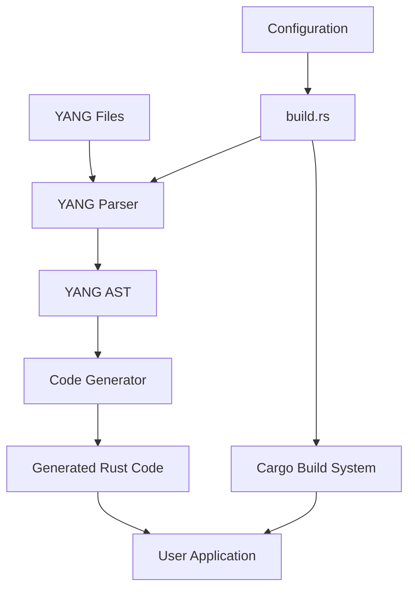

# Design Document: rustconf

## Overview

rustconf is a Rust build library that generates type-safe bindings from RESTCONF/YANG specifications at compile time. The library consists of three main components:

1. **YANG Parser**: Parses YANG 1.0/1.1 specification files into an abstract syntax tree (AST)
2. **Code Generator**: Transforms the YANG AST into idiomatic Rust code with type-safe bindings
3. **Build Integration**: Provides build.rs integration for seamless cargo workflow

The design emphasizes compile-time correctness by mapping YANG schema constraints to Rust's type system, ensuring that invalid configurations are caught during compilation rather than at runtime.

## Architecture

### High-Level Architecture



### Component Interaction

The library operates in two phases:

**Build Phase (compile time)**:
1. User's build.rs invokes rustconf API with YANG file paths and configuration
2. YANG Parser reads and parses YANG files, resolving imports and dependencies
3. Parser produces a validated YANG AST
4. Code Generator traverses AST and emits Rust code to output directory
5. Generated code is included in the main crate via `include!` or module system

**Runtime Phase**:
1. User application uses generated types and functions
2. Generated code handles serialization/deserialization with serde
3. Generated validation logic enforces YANG constraints
4. User interacts with RESTCONF servers using type-safe API

### Build System Integration Strategy

We will provide **build.rs integration** as the primary mechanism:

**Rationale**:
- Build scripts run before main compilation, allowing generated code to be available to the entire crate
- Easier to handle file I/O and multiple YANG files
- Better error reporting through cargo's build script protocol
- More flexible for complex generation scenarios (multiple modules, conditional generation)
- Procedural macros have limitations with file I/O and are harder to debug

**Alternative considered**: Procedural macros could be added later for inline YANG definitions, but build.rs is more appropriate for the primary use case of generating bindings from external YANG files.

## Components and Interfaces

### 1. YANG Parser Module

**Purpose**: Parse YANG specification files into a structured AST.

**Public API**:
```rust
pub struct YangParser {
    search_paths: Vec<PathBuf>,
}

impl YangParser {
    pub fn new() -> Self;
    pub fn add_search_path(&mut self, path: PathBuf);
    pub fn parse_file(&self, path: &Path) -> Result<YangModule, ParseError>;
    pub fn parse_string(&self, content: &str, filename: &str) -> Result<YangModule, ParseError>;
}

pub struct YangModule {
    pub name: String,
    pub namespace: String,
    pub prefix: String,
    pub imports: Vec<Import>,
    pub typedefs: Vec<TypeDef>,
    pub groupings: Vec<Grouping>,
    pub data_nodes: Vec<DataNode>,
    pub rpcs: Vec<Rpc>,
    pub notifications: Vec<Notification>,
}

pub enum DataNode {
    Container(Container),
    List(List),
    Leaf(Leaf),
    LeafList(LeafList),
    Choice(Choice),
    Case(Case),
}

pub struct Container {
    pub name: String,
    pub description: Option<String>,
    pub config: bool,
    pub mandatory: bool,
    pub children: Vec<DataNode>,
}

pub struct Leaf {
    pub name: String,
    pub description: Option<String>,
    pub type_spec: TypeSpec,
    pub mandatory: bool,
    pub default: Option<String>,
}

pub enum TypeSpec {
    Int8 { range: Option<RangeConstraint> },
    Int16 { range: Option<RangeConstraint> },
    Int32 { range: Option<RangeConstraint> },
    Int64 { range: Option<RangeConstraint> },
    Uint8 { range: Option<RangeConstraint> },
    Uint16 { range: Option<RangeConstraint> },
    Uint32 { range: Option<RangeConstraint> },
    Uint64 { range: Option<RangeConstraint> },
    String { length: Option<LengthConstraint>, pattern: Option<String> },
    Boolean,
    Enumeration { values: Vec<EnumValue> },
    Union { types: Vec<TypeSpec> },
    LeafRef { path: String },
    // ... other YANG types
}

#[derive(Debug)]
pub enum ParseError {
    IoError(std::io::Error),
    SyntaxError { line: usize, column: usize, message: String },
    SemanticError { message: String },
    UnresolvedImport { module: String },
}
```

**Implementation approach**:
- Use a parser combinator library (nom) or parser generator (pest) for YANG grammar
- Implement two-pass parsing: first pass builds AST, second pass resolves references and validates semantics
- Support both YANG 1.0 (RFC 6020) and YANG 1.1 (RFC 7950)
- Handle module imports by recursively parsing imported files from search paths

### 2. Code Generator Module

**Purpose**: Transform YANG AST into idiomatic Rust code.

**Public API**:
```rust
pub struct CodeGenerator {
    config: GeneratorConfig,
}

pub struct GeneratorConfig {
    pub output_dir: PathBuf,
    pub module_name: String,
    pub enable_xml: bool,
    pub enable_validation: bool,
    pub derive_debug: bool,
    pub derive_clone: bool,
}

impl CodeGenerator {
    pub fn new(config: GeneratorConfig) -> Self;
    pub fn generate(&self, module: &YangModule) -> Result<GeneratedCode, GeneratorError>;
}

pub struct GeneratedCode {
    pub files: Vec<GeneratedFile>,
}

pub struct GeneratedFile {
    pub path: PathBuf,
    pub content: String,
}

#[derive(Debug)]
pub enum GeneratorError {
    UnsupportedFeature { feature: String },
    InvalidConfiguration { message: String },
    IoError(std::io::Error),
}
```

**Code Generation Strategy**:

1. **Type Mapping**:
   - YANG container → Rust struct
   - YANG list → Rust Vec<T> with key handling
   - YANG leaf → Rust field with appropriate type
   - YANG choice → Rust enum
   - YANG enumeration → Rust enum
   - YANG union → Rust enum with variants for each type
   - YANG typedef → Rust type alias or newtype

2. **Constraint Enforcement**:
   - Mandatory fields → non-Option types
   - Optional fields → Option<T>
   - Range constraints → newtype wrappers with validation
   - Pattern constraints → newtype wrappers with regex validation
   - Length constraints → validated in deserialization

3. **Naming Conventions**:
   - Convert YANG kebab-case to Rust snake_case for fields/functions
   - Convert YANG names to PascalCase for types
   - Handle Rust keywords by appending underscore (e.g., "type" → "type_")

4. **Generated Code Structure**:
   ```rust
   // Generated module structure
   pub mod {module_name} {
       use serde::{Serialize, Deserialize};
       
       // Type definitions
       #[derive(Debug, Clone, Serialize, Deserialize)]
       pub struct ContainerName {
           pub field_name: FieldType,
           #[serde(skip_serializing_if = "Option::is_none")]
           pub optional_field: Option<OtherType>,
       }
       
       // Validation types for constrained values
       #[derive(Debug, Clone)]
       pub struct ValidatedInt32 {
           value: i32,
       }
       
       impl ValidatedInt32 {
           pub fn new(value: i32) -> Result<Self, ValidationError> {
               // Range validation
           }
       }
       
       // RESTCONF operation functions
       pub mod operations {
           pub fn get_config(/* params */) -> Result<ConfigData, Error> {
               // Implementation
           }
       }
   }
   ```

### 3. Build Integration Module

**Purpose**: Provide easy-to-use API for build.rs scripts.

**Public API**:
```rust
pub struct RustconfBuilder {
    yang_files: Vec<PathBuf>,
    search_paths: Vec<PathBuf>,
    output_dir: PathBuf,
    config: GeneratorConfig,
}

impl RustconfBuilder {
    pub fn new() -> Self;
    pub fn yang_file(mut self, path: impl Into<PathBuf>) -> Self;
    pub fn search_path(mut self, path: impl Into<PathBuf>) -> Self;
    pub fn output_dir(mut self, path: impl Into<PathBuf>) -> Self;
    pub fn enable_xml(mut self, enable: bool) -> Self;
    pub fn enable_validation(mut self, enable: bool) -> Self;
    pub fn generate(self) -> Result<(), BuildError>;
}

#[derive(Debug)]
pub enum BuildError {
    ParseError(ParseError),
    GeneratorError(GeneratorError),
    IoError(std::io::Error),
}
```

**Usage in build.rs**:
```rust
// Example build.rs
fn main() {
    rustconf::RustconfBuilder::new()
        .yang_file("specs/example.yang")
        .search_path("specs/")
        .output_dir(std::env::var("OUT_DIR").unwrap())
        .enable_validation(true)
        .generate()
        .expect("Failed to generate RESTCONF bindings");
    
    println!("cargo:rerun-if-changed=specs/example.yang");
}
```

## Data Models

### YANG AST Representation

The internal AST closely mirrors the YANG specification structure:

```rust
// Core AST nodes
pub struct YangModule {
    pub header: ModuleHeader,
    pub meta: ModuleMeta,
    pub linkage: Vec<LinkageStatement>,
    pub definitions: Vec<Definition>,
    pub data_definitions: Vec<DataDefinition>,
}

pub struct ModuleHeader {
    pub yang_version: YangVersion,
    pub name: String,
    pub namespace: String,
    pub prefix: String,
}

pub enum YangVersion {
    V1_0,
    V1_1,
}

pub struct Import {
    pub module: String,
    pub prefix: String,
    pub revision: Option<String>,
}

// Type system representation
pub struct TypeDef {
    pub name: String,
    pub type_spec: TypeSpec,
    pub units: Option<String>,
    pub default: Option<String>,
}

pub struct RangeConstraint {
    pub ranges: Vec<Range>,
}

pub struct Range {
    pub min: i64,
    pub max: i64,
}

pub struct LengthConstraint {
    pub lengths: Vec<LengthRange>,
}

pub struct LengthRange {
    pub min: u64,
    pub max: u64,
}
```

### Generated Code Data Models

Generated Rust types follow these patterns:

1. **Simple Containers**:
   ```rust
   #[derive(Debug, Clone, Serialize, Deserialize)]
   pub struct InterfaceConfig {
       pub name: String,
       pub enabled: bool,
       #[serde(skip_serializing_if = "Option::is_none")]
       pub description: Option<String>,
   }
   ```

2. **Lists with Keys**:
   ```rust
   #[derive(Debug, Clone, Serialize, Deserialize)]
   pub struct Interface {
       pub name: String,  // key
       pub config: InterfaceConfig,
       pub state: InterfaceState,
   }
   
   pub type Interfaces = Vec<Interface>;
   ```

3. **Choices as Enums**:
   ```rust
   #[derive(Debug, Clone, Serialize, Deserialize)]
   #[serde(rename_all = "kebab-case")]
   pub enum AddressType {
       Ipv4Address(Ipv4Addr),
       Ipv6Address(Ipv6Addr),
   }
   ```

4. **Validated Types**:
   ```rust
   #[derive(Debug, Clone)]
   pub struct Port {
       value: u16,
   }
   
   impl Port {
       pub fn new(value: u16) -> Result<Self, ValidationError> {
           if value >= 1 && value <= 65535 {
               Ok(Port { value })
           } else {
               Err(ValidationError::OutOfRange {
                   value: value.to_string(),
                   constraint: "1..65535".to_string(),
               })
           }
       }
       
       pub fn value(&self) -> u16 {
           self.value
       }
   }
   
   impl Serialize for Port {
       fn serialize<S>(&self, serializer: S) -> Result<S::Ok, S::Error>
       where S: Serializer {
           self.value.serialize(serializer)
       }
   }
   
   impl<'de> Deserialize<'de> for Port {
       fn deserialize<D>(deserializer: D) -> Result<Self, D::Error>
       where D: Deserializer<'de> {
           let value = u16::deserialize(deserializer)?;
           Port::new(value).map_err(serde::de::Error::custom)
       }
   }
   ```


## Correctness Properties

A property is a characteristic or behavior that should hold true across all valid executions of a system—essentially, a formal statement about what the system should do. Properties serve as the bridge between human-readable specifications and machine-verifiable correctness guarantees.

### Property 1: Valid YANG Parsing Success
*For any* valid YANG specification file (version 1.0 or 1.1), parsing should succeed and produce a well-formed abstract syntax tree without errors.
**Validates: Requirements 1.1, 1.2**

### Property 2: Invalid YANG Parsing Errors
*For any* invalid YANG specification file, parsing should fail and return an error containing file name, line number, column number, and a descriptive message.
**Validates: Requirements 1.3, 7.1**

### Property 3: Import Resolution
*For any* YANG module with imports, if all imported modules are available in the search paths, then parsing should successfully resolve and load all imported modules.
**Validates: Requirements 1.4, 7.4**

### Property 4: Grouping and Typedef Expansion
*For any* YANG module using groupings or typedefs, parsing should correctly expand and resolve these definitions such that the resulting AST contains the fully expanded data nodes.
**Validates: Requirements 1.5**

### Property 5: Type Constraint Preservation
*For any* YANG leaf node with type constraints (range, pattern, length), the generated Rust type should enforce the same constraints through validation logic or type system guarantees.
**Validates: Requirements 2.1, 2.5**

### Property 6: Container to Struct Mapping
*For any* YANG container definition, the generated Rust code should contain a struct with fields corresponding exactly to the container's child nodes, preserving names (converted to Rust conventions) and types.
**Validates: Requirements 2.2**

### Property 7: List to Collection Mapping
*For any* YANG list definition, the generated Rust code should contain a collection type (Vec) with elements that include all key fields as non-optional members.
**Validates: Requirements 2.3**

### Property 8: Choice to Enum Mapping
*For any* YANG choice statement, the generated Rust code should contain an enum with variants corresponding to each case, ensuring mutual exclusivity.
**Validates: Requirements 2.4**

### Property 9: Optionality Mapping
*For any* YANG data node, if the node is mandatory then the generated Rust type should be non-optional, and if the node is optional then the generated Rust type should be Option-wrapped.
**Validates: Requirements 2.6, 2.7**

### Property 10: Build Directive Emission
*For any* set of input YANG files, the build system should emit cargo:rerun-if-changed directives for each input file.
**Validates: Requirements 3.4**

### Property 11: Build Error Reporting
*For any* generation failure (parse error, validation error, I/O error), the build system should report the error through cargo's build script protocol with a descriptive message.
**Validates: Requirements 3.5**

### Property 12: RPC Function Generation
*For any* YANG RPC definition, the generated Rust code should contain a function with input parameters matching the RPC input node and return type matching the RPC output node.
**Validates: Requirements 4.1**

### Property 13: Notification Type Generation
*For any* YANG notification definition, the generated Rust code should contain a struct representing the notification payload with fields matching the notification's child nodes.
**Validates: Requirements 4.2**

### Property 14: RESTCONF Operation Generation
*For any* YANG data node that represents a configuration or state resource, the generated Rust code should include functions for applicable RESTCONF operations (GET, POST, PUT, PATCH, DELETE).
**Validates: Requirements 4.3**

### Property 15: Operation Error Handling
*For any* generated operation function, the return type should be a Result type with an appropriate error enum.
**Validates: Requirements 4.4**

### Property 16: URL Path Generation
*For any* YANG data tree path, the generated code should construct RESTCONF URLs that correctly represent the hierarchical structure with proper encoding of keys and identifiers.
**Validates: Requirements 4.5**

### Property 17: Required Trait Implementations
*For any* generated data type, the type should implement Serialize, Deserialize, Debug, and Display traits.
**Validates: Requirements 5.1, 10.1, 10.2**

### Property 18: RESTCONF JSON Compliance
*For any* generated data type instance, serializing to JSON should produce output that conforms to RESTCONF JSON encoding rules (RFC 8040).
**Validates: Requirements 5.2**

### Property 19: Deserialization Validation
*For any* generated data type with YANG constraints, deserializing invalid data (violating range, pattern, or length constraints) should fail with a descriptive validation error.
**Validates: Requirements 5.3, 7.3**

### Property 20: XML Encoding Support
*For any* generated data type instance, when XML support is enabled, serializing to XML should produce output that conforms to RESTCONF XML encoding rules.
**Validates: Requirements 5.4**

### Property 21: Namespace Handling
*For any* YANG module with a namespace declaration, the generated serialization code should correctly handle namespace prefixes in JSON and XML output.
**Validates: Requirements 5.5**

### Property 22: Documentation Generation
*For any* YANG node with a description statement, the generated Rust code should include a rustdoc comment containing that description.
**Validates: Requirements 6.5**

### Property 23: Semantic Validation Errors
*For any* YANG semantic constraint violation (undefined reference, type mismatch, circular dependency), the parser should return an error describing which constraint was violated.
**Validates: Requirements 7.2, 7.5**

### Property 24: Naming Convention Conversion
*For any* YANG identifier, the generated Rust code should convert it to appropriate Rust naming conventions: snake_case for fields and functions, PascalCase for types, with Rust keywords escaped.
**Validates: Requirements 8.1**

### Property 25: Code Quality Standards
*For any* generated Rust code, it should pass rustfmt formatting, clippy lints with default settings, and use idiomatic Rust patterns (Result for errors, Option for optional values).
**Validates: Requirements 8.2, 8.3, 8.4**

### Property 26: Feature Configuration
*For any* configuration option (enable_xml, enable_validation, etc.), enabling or disabling the feature should result in generated code that includes or excludes the corresponding functionality.
**Validates: Requirements 9.3**

### Property 27: Module Name Customization
*For any* configured module name, the generated Rust code should use that name for the module declaration and all internal references.
**Validates: Requirements 9.4**

### Property 28: Configuration Validation
*For any* invalid configuration (missing required fields, invalid paths, conflicting options), the build system should return a clear error message describing the configuration problem.
**Validates: Requirements 9.5**

### Property 29: Serialization Round-Trip
*For any* valid instance of a generated data type, serializing to JSON/XML and then deserializing should produce an equivalent value (serialize → deserialize → equivalent).
**Validates: Requirements 10.3**

### Property 30: Deserialization Round-Trip
*For any* valid JSON/XML document conforming to the YANG schema, deserializing to a Rust type and then serializing should produce equivalent JSON/XML (deserialize → serialize → equivalent).
**Validates: Requirements 10.4**

## Error Handling

### Error Types

The library defines several error types for different failure scenarios:

1. **ParseError**: YANG parsing failures
   - Syntax errors with location information
   - Semantic validation errors
   - Unresolved imports
   - I/O errors reading YANG files

2. **GeneratorError**: Code generation failures
   - Unsupported YANG features
   - Invalid configuration
   - I/O errors writing generated files

3. **BuildError**: Build integration failures
   - Wraps ParseError and GeneratorError
   - Provides context for build script failures

4. **ValidationError**: Runtime validation failures in generated code
   - Range constraint violations
   - Pattern match failures
   - Length constraint violations
   - Type conversion errors

### Error Handling Strategy

**At Build Time**:
- All errors should be reported through cargo's build script protocol
- Error messages should include file paths, line numbers, and actionable suggestions
- The build should fail fast on first error to avoid cascading failures
- Warnings should be emitted for deprecated YANG features or potential issues

**At Runtime** (in generated code):
- All fallible operations return Result types
- Validation errors include the violating value and the constraint that was violated
- Deserialization errors from serde are wrapped with additional context
- No panics in generated code except for programmer errors (e.g., invalid internal state)

### Error Recovery

- Parser should attempt to continue after syntax errors to report multiple issues
- Generator should validate entire AST before code generation to catch all issues upfront
- Build system should clean up partial output files on failure

## Testing Strategy

### Dual Testing Approach

The rustconf library will use both unit tests and property-based tests for comprehensive coverage:

**Unit Tests**: Focus on specific examples, edge cases, and integration points
- Specific YANG constructs (empty containers, deeply nested structures)
- Edge cases (maximum integer values, empty strings, special characters)
- Error conditions (missing files, circular imports, invalid syntax)
- Integration between parser and generator
- Build system integration with example projects

**Property-Based Tests**: Verify universal properties across all inputs
- Use the `proptest` crate for property-based testing in Rust
- Generate random YANG AST structures and verify properties hold
- Generate random data instances and verify serialization/deserialization
- Each property test should run minimum 100 iterations
- Each test should reference its design document property with a comment

### Property Test Configuration

Each property-based test will be tagged with a comment referencing the design property:

```rust
#[test]
fn test_serialization_round_trip() {
    // Feature: rustconf, Property 29: Serialization Round-Trip
    // For any valid instance of a generated data type, serializing to JSON/XML 
    // and then deserializing should produce an equivalent value
    
    proptest!(|(data in arbitrary_config_data())| {
        let json = serde_json::to_string(&data).unwrap();
        let deserialized: ConfigData = serde_json::from_str(&json).unwrap();
        prop_assert_eq!(data, deserialized);
    });
}
```

### Testing Layers

1. **Parser Tests**:
   - Unit tests for specific YANG constructs
   - Property tests for valid/invalid YANG generation
   - Round-trip tests: YANG → AST → YANG (if pretty printer is implemented)

2. **Generator Tests**:
   - Unit tests for specific code generation scenarios
   - Property tests for naming conventions, trait implementations
   - Compilation tests: verify generated code compiles without errors

3. **Integration Tests**:
   - End-to-end tests with real YANG modules
   - Build system integration tests with example projects
   - RESTCONF compliance tests with sample data

4. **Generated Code Tests**:
   - Property tests for serialization round-trips
   - Unit tests for validation logic
   - Tests for RESTCONF operation functions

### Test Data

- Use real-world YANG modules from IETF RFCs (ietf-interfaces, ietf-ip, etc.)
- Create minimal YANG modules for specific feature testing
- Generate random but valid YANG structures for property testing
- Include known problematic cases from YANG specification edge cases
