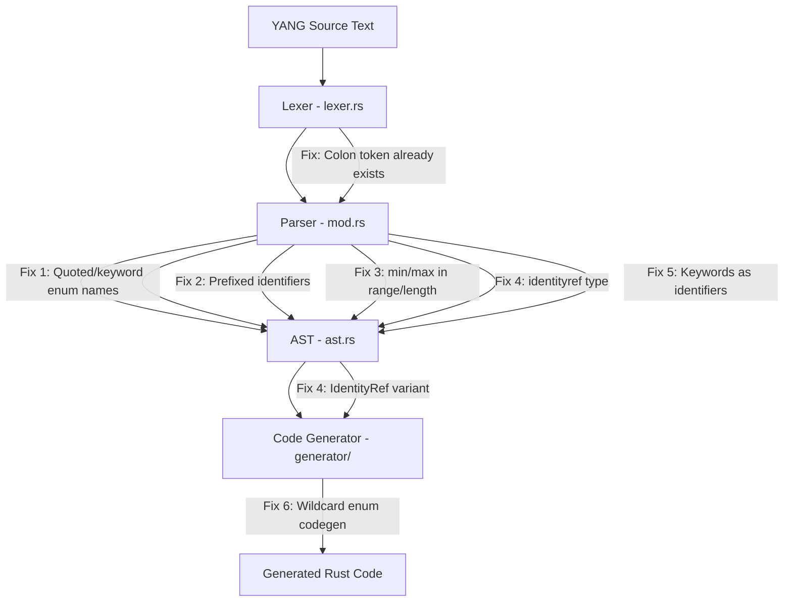

# Design Document: YANG Parser Compliance

## Overview

The rustconf YANG parser currently fails on 37 of 40 real-world vendor YANG models due to six categories of compliance gaps. This design addresses parser-level fixes to the lexer (`lexer.rs`), parser (`mod.rs`), AST (`ast.rs`), and code generator (`generator/types.rs`, `generator/naming.rs`) that will unlock approximately 34 of those 37 failing models.

The changes are surgical — each fix targets a specific gap in RFC 7950 compliance without restructuring the parser architecture. The fixes are ordered by impact (number of models unblocked) and are independent of each other, allowing incremental delivery.

### Key Design Decisions

1. **Prefixed identifiers stored as flat strings**: Rather than introducing a structured `PrefixedIdentifier { prefix, name }` type, we store `prefix:name` as a single string in `TypedefRef.name` and `Uses.name`. This minimizes AST changes and aligns with how the parser already handles typedef references. Cross-module resolution is out of scope.

2. **`identityref` maps to `String`**: Since identity resolution requires runtime knowledge of the full identity hierarchy (including imported modules), we represent `identityref` values as `String` in generated Rust code. This is consistent with how `leafref` is already handled.

3. **Keyword-as-identifier via `parse_identifier_or_keyword`**: The existing method already handles several keywords. We extend it to cover all keyword tokens rather than adding a separate mechanism.

4. **Wildcard enum `*` mapped to `Star` variant**: The code generator maps the `*` enum name to a Rust variant named `Star` with a `#[serde(rename = "*")]` attribute for round-trip serialization fidelity.

## Architecture

The changes span four layers of the rustconf pipeline:



**No lexer changes are required.** The lexer already produces `Colon`, `StringLiteral`, and all keyword tokens. All fixes are in the parser and code generator layers.

## Components and Interfaces

### 1. Parser Changes (`rustconf/src/parser/mod.rs`)

#### `parse_identifier_or_keyword` — Extended keyword coverage

**Current state**: Handles ~10 keyword tokens (Description, Type, Config, etc.).

**Change**: Add match arms for ALL keyword tokens defined in `Token::is_keyword()`. This is the single change that enables Requirement 5 (keywords as identifiers) and partially enables Requirement 1 (keywords as enum names).

```rust
fn parse_identifier_or_keyword(&mut self) -> Result<String, ParseError> {
    match self.advance() {
        Token::Identifier(id) => Ok(id),
        // All YANG keywords accepted as identifiers
        Token::Module => Ok("module".to_string()),
        Token::Submodule => Ok("submodule".to_string()),
        Token::Namespace => Ok("namespace".to_string()),
        Token::Prefix => Ok("prefix".to_string()),
        Token::Import => Ok("import".to_string()),
        Token::Include => Ok("include".to_string()),
        // ... all remaining keyword tokens ...
        token => Err(self.error(format!("Expected identifier, found {:?}", token))),
    }
}
```

#### `parse_enum_value` — Accept StringLiteral and keyword tokens

**Current state**: Only accepts `Token::Identifier` as enum name.

**Change**: Accept `Token::StringLiteral`, `Token::Identifier`, and any keyword token as the enum name argument.

```rust
fn parse_enum_value(&mut self) -> Result<EnumValue, ParseError> {
    self.expect(Token::Enum)?;
    let name = match self.peek() {
        Token::StringLiteral(_) => {
            match self.advance() {
                Token::StringLiteral(s) => s,
                _ => unreachable!(),
            }
        }
        Token::Identifier(_) => {
            match self.advance() {
                Token::Identifier(id) => id,
                _ => unreachable!(),
            }
        }
        tok if tok.is_keyword() => {
            self.parse_identifier_or_keyword()?
        }
        _ => return Err(self.error(format!(
            "Expected enum name, found {:?}", self.peek()
        ))),
    };
    // ... rest unchanged ...
}
```

#### `parse_type_spec` — Handle prefixed type references

**Current state**: Only matches `Token::Identifier` for typedef references.

**Change**: After consuming an `Identifier` token, check if the next token is `Colon` followed by another `Identifier`. If so, combine them into `prefix:name`.

```rust
Token::Identifier(_) => {
    let first = match self.advance() {
        Token::Identifier(id) => id,
        _ => unreachable!(),
    };
    // Check for prefix:name pattern
    let name = if self.peek() == &Token::Colon {
        self.advance(); // consume colon
        let second = self.parse_identifier_or_keyword()?;
        format!("{}:{}", first, second)
    } else {
        first
    };
    TypeSpec::TypedefRef { name }
}
```

#### `parse_uses` — Handle prefixed grouping references

**Current state**: Only accepts `Token::Identifier` for grouping name.

**Change**: After consuming the identifier, check for `Colon` + `Identifier` pattern, same as type references.

#### `parse_type_spec` — Handle `identityref` type

**Current state**: No match arm for `Token::IdentityRef`.

**Change**: Add a match arm that creates a new `TypeSpec::IdentityRef` variant, then parse the type body to extract the `base` statement.

```rust
Token::IdentityRef => {
    self.advance();
    TypeSpec::IdentityRef { base: String::new() }
}
```

In `parse_type_body`, add handling for the `Base` token inside an `IdentityRef` type:

```rust
Token::Base => {
    self.advance();
    let base_name = self.parse_identifier_or_keyword()?;
    // Handle prefixed base (e.g., base ianaift:iana-interface-type)
    let base_name = if self.peek() == &Token::Colon {
        self.advance();
        let suffix = self.parse_identifier_or_keyword()?;
        format!("{}:{}", base_name, suffix)
    } else {
        base_name
    };
    self.expect(Token::Semicolon)?;
    if let TypeSpec::IdentityRef { ref mut base, .. } = type_spec {
        *base = base_name;
    }
}
```

#### `parse_range_string` / `parse_length_string` — Handle `min` and `max` keywords

**Current state**: Calls `parse::<i64>()` / `parse::<u64>()` directly, which fails on `"min"` and `"max"`.

**Change**: Before parsing as a number, check if the trimmed string is `"min"` or `"max"` and substitute the appropriate type-bound value. Since `parse_range_string` doesn't know the enclosing numeric type, we use the widest bounds (`i64::MIN`/`i64::MAX` for range, `0`/`u64::MAX` for length). This is safe because YANG's `min`/`max` keywords refer to the type's own bounds, and the semantic validator already checks that range values are within the type's domain.

```rust
fn parse_range_value(s: &str) -> Result<i64, ParseError> {
    let trimmed = s.trim();
    match trimmed {
        "min" => Ok(i64::MIN),
        "max" => Ok(i64::MAX),
        _ => trimmed.parse::<i64>().map_err(|_| ...),
    }
}

fn parse_length_value(s: &str) -> Result<u64, ParseError> {
    let trimmed = s.trim();
    match trimmed {
        "min" => Ok(0),
        "max" => Ok(u64::MAX),
        _ => trimmed.parse::<u64>().map_err(|_| ...),
    }
}
```

### 2. AST Changes (`rustconf/src/parser/ast.rs`)

#### New `TypeSpec::IdentityRef` variant

```rust
pub enum TypeSpec {
    // ... existing variants ...
    /// Identity reference type (RFC 7950 §7.18)
    IdentityRef {
        base: String,
    },
}
```

This is the only AST change required. All other fixes operate within existing AST structures.

### 3. Code Generator Changes

#### `generator/types.rs` — Handle `TypeSpec::IdentityRef`

Add a match arm in `generate_leaf_type`:

```rust
TypeSpec::IdentityRef { .. } => "String",
```

#### `generator/naming.rs` — Wildcard enum name mapping

Add special-case handling in enum variant name generation for the `*` character:

```rust
fn sanitize_enum_variant_name(name: &str) -> String {
    match name {
        "*" => "Star".to_string(),
        _ => to_pascal_case(name),
    }
}
```

#### `generator/types.rs` — Serde rename for special enum variants

When generating enum variants from `EnumValue` nodes, always emit a `#[serde(rename = "original_name")]` attribute so that non-identifier names like `*` round-trip correctly through serialization.

### 4. Validation Changes (`rustconf/src/parser/mod.rs`)

#### `validate_typespec_constraints` — Handle `IdentityRef`

The existing constraint validator match arms don't cover `IdentityRef`. Since `IdentityRef` has no constraints to validate, no change is needed — the catch-all `_ => {}` arm handles it.

#### `validate_typespec_references` — Skip prefixed typedef refs

Prefixed typedef references (`prefix:name`) refer to types in imported modules. Since cross-module resolution is out of scope, the validator should skip validation for prefixed references (names containing `:`).

## Data Models

### AST Type Changes

```rust
// In ast.rs — only addition
pub enum TypeSpec {
    // ... all existing variants unchanged ...
    
    /// Identity reference type (RFC 7950 §7.18).
    /// Values are identity names resolved at runtime.
    IdentityRef {
        /// The base identity name (may be prefixed, e.g., "ianaift:iana-interface-type")
        base: String,
    },
}
```

### No changes to:
- `EnumValue` — already has `name: String` which can hold `*`, quoted strings, and keywords
- `TypedefRef` — already has `name: String` which can hold `prefix:name`
- `Uses` — already has `name: String` which can hold `prefix:name`
- `RangeConstraint` / `LengthConstraint` — already store numeric values; `min`/`max` are resolved during parsing

## Correctness Properties

*A property is a characteristic or behavior that should hold true across all valid executions of a system — essentially, a formal statement about what the system should do. Properties serve as the bridge between human-readable specifications and machine-verifiable correctness guarantees.*

### Property 1: Enum name round-trip

*For any* valid YANG enum name (unquoted identifier, quoted string, or keyword token), constructing a `type enumeration { enum <name>; }` block, parsing it, printing the resulting AST back to YANG text, and parsing again SHALL produce an equivalent `EnumValue` AST node.

**Validates: Requirements 1.1, 1.2, 1.3, 1.4**

### Property 2: Prefixed identifier preservation

*For any* pair of valid YANG identifiers `(prefix, name)`, when used as a type reference (`type prefix:name;`) or uses reference (`uses prefix:name;`), the parser SHALL produce an AST node whose name field contains the exact string `"prefix:name"`.

**Validates: Requirements 2.1, 2.2, 2.3**

### Property 3: min/max keyword resolution in constraints

*For any* range or length constraint string containing `min` or `max` keywords (e.g., `"min..100"`, `"0..max"`, `"min..max"`), the parser SHALL produce a constraint whose numeric bounds are equal to the type-appropriate extreme values (`i64::MIN`/`i64::MAX` for signed ranges, `0`/`u64::MAX` for unsigned ranges and lengths).

**Validates: Requirements 3.1, 3.2, 3.3, 3.4, 3.5**

### Property 4: identityref base name preservation

*For any* valid YANG identity name (including prefixed names like `prefix:identity-name`), when used as the `base` argument in `type identityref { base <name>; }`, the parser SHALL produce a `TypeSpec::IdentityRef` node whose `base` field contains the exact identity name string.

**Validates: Requirements 4.1, 4.2, 4.3**

### Property 5: Keywords accepted as identifiers in name positions

*For any* YANG keyword token that has a textual representation matching a valid YANG identifier, when used as the name argument of a `leaf`, `container`, `list`, `grouping`, `choice`, `case`, or `typedef` statement, the parser SHALL accept it and produce an AST node whose name field matches the keyword text.

**Validates: Requirements 5.1, 5.2, 5.3**

## Error Handling

### Parse Errors

| Condition | Error Type | Message |
|-----------|-----------|---------|
| `identityref` without `base` statement | `ParseError::SemanticError` | `"Missing required 'base' statement in identityref type"` |
| Invalid range value (not a number, not `min`/`max`) | `ParseError::SyntaxError` | `"Invalid range min/max value: <value>"` |
| Invalid length value (not a number, not `min`/`max`) | `ParseError::SyntaxError` | `"Invalid length min/max value: <value>"` |
| Unexpected token in enum name position | `ParseError::SyntaxError` | `"Expected enum name (identifier, string, or keyword), found <token>"` |

### Graceful Degradation

- **Unresolved prefixed references**: The semantic validator skips validation for prefixed typedef/grouping references (names containing `:`), since cross-module resolution is out of scope. The parser succeeds; resolution errors surface at code generation time if the type is actually used.
- **Unknown identity bases**: The parser stores the base name as-is without validating that the identity exists. This is consistent with how `leafref` paths are handled (stored but not resolved).

## Testing Strategy

### Property-Based Tests (proptest)

Property-based tests use the `proptest` crate (already a dev-dependency) with a minimum of 100 iterations per property. Each test is tagged with a comment referencing the design property.

| Property | Test Description | Generator Strategy |
|----------|-----------------|-------------------|
| Property 1 | Enum name round-trip | Generate random strings (alphanumeric, with spaces/special chars), YANG identifiers, and keyword names. Wrap in `type enumeration { enum <name>; }`, parse, print, re-parse, compare. |
| Property 2 | Prefixed identifier preservation | Generate pairs of valid YANG identifiers (alphanumeric + hyphens, starting with letter). Construct `type prefix:name;` and `uses prefix:name;`, parse, verify name field. |
| Property 3 | min/max keyword resolution | Generate constraint strings mixing `min`, `max`, and integer literals with `..` separator. Parse as range and length constraints, verify numeric bounds. |
| Property 4 | identityref base preservation | Generate valid identity names (plain and prefixed). Construct `type identityref { base <name>; }`, parse, verify base field. |
| Property 5 | Keywords as identifiers | For each keyword token, generate a `leaf <keyword> { type string; }` statement, parse, verify leaf name matches keyword text. |

### Unit Tests (example-based)

| Test | Description | Validates |
|------|-------------|-----------|
| `test_enum_wildcard_star` | Parse `enum "*"` and verify EnumValue name is `"*"` | Req 6.1 |
| `test_wildcard_codegen_variant` | Generate code for `*` enum, verify variant name is `Star` | Req 6.2 |
| `test_wildcard_serde_rename` | Verify `*` variant has `#[serde(rename = "*")]` | Req 6.3 |
| `test_identityref_missing_base` | Parse `type identityref {}`, verify descriptive error | Req 4.5 |
| `test_keyword_in_statement_position` | Verify keywords at statement start are still keywords | Req 5.2 |
| `test_prefixed_path_not_misinterpreted` | Verify colons in leafref paths are preserved | Req 2.4 |
| `test_codegen_identityref_string` | Verify IdentityRef generates `String` type | Req 4.4 |

### Integration Tests

| Test | Description | Validates |
|------|-------------|-----------|
| `test_vendor_model_parse_count` | Run integration harness against 40 vendor models, assert ≥34 succeed | Req 7.1 |
| `test_failed_models_report_errors` | Verify failed models produce descriptive error messages | Req 7.2 |
| `test_generated_code_compiles` | Verify generated code compiles (handled by build.rs) | Req 7.3 |

### Test Configuration

- **Property test iterations**: 100 minimum per property (proptest default `PROPTEST_CASES=100`)
- **Tag format**: `// Feature: yang-parser-compliance, Property N: <property_text>`
- **Test location**: `rustconf/src/parser/tests/` for parser properties, `rustconf/src/generator/tests/` for codegen tests
- **Integration tests**: `tests/integration/tests/` using existing harness
